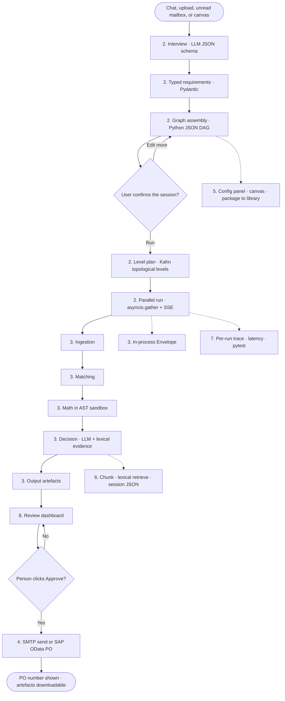

# Nexus 2.0 — Current technical flow (block guide)

Companion to `Nexus_Architecture_Current.png` (from `Nexus_Architecture_Current.html`). Each heading below is one box or chip on that picture.

**How to read a block:** three to four short paragraphs of what it is for, then the **current tech** the repo actually runs, then a two-line example. Every chip is green — **in the current build**. There is no blue “next phase” layer on this picture. The hand icon means a person must click. This file describes **what the code does today**, not the enterprise target.

**The whole picture in one breath:** work arrives at chat, upload, unread mail, the canvas, an approve click or a download; FastAPI interviews and types the answers; Python builds a JSON DAG and runs it by Kahn levels with `asyncio.gather` and SSE; five skills execute as registered classes and hand an in-process Envelope (not A2A); writers, IMAP, SMTP and SAP OData are compiled-in connectors, and mail/SAP wait for a person; the workbench packages a JSON flow; context is lexical retrieval plus a session JSON file; assurance is a per-run trace; review is the dashboard; it all sits on FastAPI, Pydantic, React and files on disk.

The enterprise pictures (`Nexus_Architecture_Enterprise.png` and `_v2.png`) are the *next* build. Do not mix those chips into this file.

### Complete flow (how to read the picture)

Left-to-right on the PNG is the same path as this chart: a door, typed requirements, a JSON graph, a level-by-level run inside one HTTP request, five skills, a human click, then a side effect. There is no checkpoint, no worker pool, and no OIDC on this picture.

| Phase on the picture | What actually happens | Ceiling in this build |
|---|---|---|
| 1 Touchpoints | Chat, upload, unread IMAP, canvas, approve, download | No Slack, no SAP webhook, no API gateway |
| 2 Orchestration | Interview → Pydantic slots → JSON DAG → Kahn levels → one HTTP run | Crash loses the run; no resume after approve |
| 3 Skills | Five registered classes + YAML; Envelope in process | Not A2A; not LangGraph nodes |
| 4 Reach-out | openpyxl, ReportLab, IMAP, SMTP, SAP PO, Gemini / AI Core | Compiled-in only; mail/SAP wait for a click |
| 5 Workbench | Chat, generated panel, canvas, confirm, package JSON | No dry-run policy, no golden, no promote pin |
| 6 Context | Parse, chunk, extract, lexical retrieve, session JSON | No vector index, no tenant ACL, file dies with session |
| 7 Assurance | Per-run trace, step latency, logs, lineage, ask-the-run, pytest | One run, not the fleet; no drift, no cost budget |
| 8 Review and release | Dashboard, edit+send, SAP post, download | Approve is a button, not `nexus.approve` RBAC |
| 9 Foundation | FastAPI, Pydantic, asyncio, React, files on disk, CF | No Postgres, Redis, workers, or mesh |

---

## 1. Touchpoints

These are the doors into Nexus **today**. A person types, drops a file, or an unread mailbox is polled. The same person later confirms the canvas, clicks Approve, and downloads the workbook. There is no API gateway in front of FastAPI on this picture: the React app talks to the Uvicorn process. There is no Slack inbound and no SAP event that starts a run.

Read the rail left to right as *how work is born*, not as a sequence every run must walk. Chat is how a **new** flow is designed. Upload and mailbox are how documents arrive. Canvas is where the user still owns the graph. Approve is not intake — it is the click that later releases mail or a SAP post. Download is the last human door. The person icon under the rail is that human: design, confirm, approve.

What this rail does **not** do: authenticate against an IdP, rate-limit a model loop at the edge, scan uploads in object storage, or start a run from a signed SAP webhook. Those are enterprise-picture items. Today, if the process restarts mid-interview, the session is whatever was last flushed to disk.

Nothing on this rail auto-posts to SAP or sends mail. System intake (mailbox) may *start* work; it may not *finish* a write. The hand icon on Approve is that rule.

### Chat prompt

This is the interview screen. A finance user types the goal in plain language and answers follow-up questions. The client is a React app calling FastAPI. Chat is how a *new* flow is born. Saved flows later start from the library without another full interview, but the first graph still comes from this conversation.

**Current tech:** React SPA → FastAPI chat/interview routes. LLM JSON-schema responses with repair (section 2).

**Example:** Priya types “Match this month’s invoices to POs and flag variance over 5%.” The assistant asks which columns are the keys; a graph appears on the canvas instead of a developer writing a job.

### Spreadsheet & document upload

Files are accepted as multipart on the API and stored with the session on disk. Spreadsheets (pandas / openpyxl) and PDFs (pypdf) take this path. There is no object-store signed upload and no malware scan in this build — the file lives next to the JSON session. OCR of photos/scans is not a first-class door; native PDFs and tables are.

**Current tech:** FastAPI `UploadFile` / multipart. Bytes on the atomic file store (section 9). Parsed later by Ingestion.

**Example:** Priya drops `invoices.xlsx` and `pos.pdf`. Both attach to the session. Ingestion infers columns on the next step; the files are not in S3.

### Mailbox, unread only

An IMAP inbox is polled for UNSEEN messages, then those messages are flagged so the same mail is not processed twice. That unread-then-flag pattern is naturally idempotent and is kept on purpose. Credentials live in settings, not in a vault. If the mailbox is down, the dashboard is empty — there is no alert chip on this picture.

**Current tech:** IMAP client, UNSEEN then flag. Same path Ingestion can also use as a mailbox-read connector (section 4).

**Example:** A vendor mails `invoice-441.pdf`. Nexus fetches that one message, flags it Seen, and the attachment becomes an upload on a session. Tomorrow the same message is not fetched again.

### Canvas edits

The canvas is the product: a user-authored JSON graph, not a compiler-owned StateGraph. After interview, Python reveals nodes; Priya can add Math, change a key, or delete a node. Saves go to the session files. Two people editing the same flow do not have a revision conflict check in this build — last write wins.

**Current tech:** React Flow (`@xyflow/react`). Graph document as JSON on disk. Schema-sync keeps node config valid.

**Example:** Priya adds a Math node and sets `variance = abs(inv - po) / po`. The JSON DAG updates; the next run uses that formula.

### Approve click (human gate)

This click is what releases a side effect — send mail or post a SAP PO. In this build it is a **button on the dashboard**, not an RBAC scope. Anyone who can open the run can click it. The product rule is still “never auto-send, never auto-post.” There is no second-approver policy and no payload hash in an append-only audit store.

**Current tech:** Dashboard API routes that call SMTP or SAP OData only after this click. Hand icon on the PNG.

**Example:** The PO payload is ready. Priya clicks Post. SAP returns a PO number which the dashboard shows. Nothing posted during the skill run itself.

### Artefact download

After a run, the themed workbook and branded PDF can be downloaded from the review dashboard. In this build they are files on disk served by the API, not short-lived signed URLs to object storage. Anyone who can hit the run’s download route can fetch them — there is no entitlement chip on this picture.

**Current tech:** openpyxl / ReportLab artefacts on the file store. FastAPI file response from the dashboard.

**Example:** Priya downloads `run_88.xlsx` from the dashboard. The file is whatever the Output skill wrote next to that run id.

---

## 2. Orchestration — understand, then assemble and run

The model fills typed values. Python builds the graph, so the same answers always produce the same flow. The run then happens **inside the FastAPI request**: Kahn levels, `asyncio.gather` per level, SSE to the browser. There is no LangGraph, no Postgres checkpoint, no worker that can wait until Monday for Approve.

This panel is the *plan and run* path. Interview turns messy intake into answers. Typed requirements freeze those answers into Pydantic slots. Graph assembly computes a user-editable JSON DAG and reveals it on the canvas. Level plan rejects cycles and groups independent nodes. Parallel run executes each level and streams progress. Skipping typed requirements is how a string leaks into a formula. Skipping the level plan is how a cycle hangs the process. Skipping “confirm” in the workbench is how a half-built graph runs.

Why this is enough for a demo and not for month-end close: if Uvicorn restarts during matching, the run is gone. Approve is a *later* HTTP call, not an interrupt on a durable graph. That is honest on this picture — do not draw a checkpointer here.

| Step | Input | Output | Why it exists |
|---|---|---|---|
| Interview | Chat / file / mail | Slot-shaped answers | Model fills *values*, not the graph |
| Typed requirements | Those answers | Pydantic objects | Same answers → same graph |
| Graph assembly | Requirements | User-editable JSON DAG | The canvas remains the product |
| Level plan | JSON DAG | Ordered levels, no cycles | Independent nodes can fan out |
| Parallel run | A level of nodes | Envelopes + SSE events | The user sees progress live |

### Interview

A bounded question loop, grounded in the upload (and mail text when that is the door). Each answer is requested as JSON against a schema and repaired if the model wraps it in markdown or extra keys. The point is the same as the enterprise pictures: the model fills *values*, it does not invent the graph. Token budgets exist as a cap on questions, not as a tenant FinOps system.

**Current tech:** LLM JSON schema + repair on the interview routes. Completions via Gemini or SAP AI Core (section 4).

**Example:** The file has columns `EBELN` and `WRBTR`. The assistant asks “which is the PO number?” Priya answers “EBELN.” A free-text essay is repaired or refused; the slot is a string on the requirement object.

### Typed requirements

Interview answers become a small set of Pydantic objects (match keys, formula, tolerance, output formats). If a value cannot be coerced, the turn fails instead of leaking a string into graph assembly. That is what keeps “same answers → same graph” true when Python, not a developer, builds the flow.

**Current tech:** Pydantic v2 models shared by API, builder and storage.

**Example:** Tolerance must be a number. “about five percent” is refused. Priya enters `5`, and graph assembly can put a real threshold on the Math node.

### Graph assembly

Python computes the desired node/edge list from those requirements and diffs it onto the canvas (progressive reveal). The user can still edit. The artefact is a JSON DAG (`Pipeline`), not a compiled LangGraph. Persistence is a JSON file on disk, not a versioned Postgres row.

**Current tech:** Python builder + Pydantic `Pipeline`. Canvas: React Flow. Reveal/schema-sync tests exist (`test_reveal`, `test_schema_sync`).

**Example:** Two files + “match on PO and date window” produces Ingestion, Matcher, Math, Decision, Output, already wired. Priya can still delete Math.

### Level plan

Before anything runs, the DAG is checked for cycles and sorted into levels: nodes with no unfinished predecessors run together. That is Kahn’s algorithm. A cycle is a hard fail — better than a hung `asyncio` loop. This is the “orchestrator” in this build: a topological plan, not a durable workflow engine.

**Current tech:** Kahn topological levels in the runner (`test_dag`).

**Example:** Ingestion A and Ingestion B have no dependency, so they share level 0. Matcher waits for both. Decision waits for Math. Output is last.

### Parallel run

Each level is `asyncio.gather`’d so independent skills overlap. Progress events are pushed to the browser with SSE. The whole run is still one process and one request. Cancel is whatever FastAPI cancellation does to that task — there is no checkpoint to resume from.

**Current tech:** `asyncio.gather` in the runner + Server-Sent Events to the React client.

**Example:** Two Ingestion nodes parse at the same time. The canvas lights them green as SSE events arrive. If the tab is closed, the server run may still finish; if the process dies, it does not resume.

---

## 3. Five specialist skills — the only things that touch the data

Each skill is a registered Python class plus a YAML behaviour file. They never call each other — they emit an Envelope. That rule is the product: routing is named ports on the graph, not `matcher.call(decision)`. A new skill is supposed to drop in without rewriting the runner, which only works if the anatomy chips are always present.

This is still the heart of Nexus: Ingestion, Matching, Math, Decision, Output. Enterprise pictures add OCR modes, knowledge-graph helpers, A2A cards and MCP scopes around the same five types. Today those extras are not here. Math is the AST sandbox on purpose. Output writes artefacts and **prepares** dispatch; it does not send mail or post to SAP.

The envelope bar is an in-process Pydantic object. The class docstring may say “A2A”; the wire is not the A2A protocol. One package per exit port. Mapping to A2A is a future boundary, not this build.

### Skill anatomy

This left-hand box is the *template* every skill shares. A customer-shaped sixth skill is meant to register the same way — class, YAML, schema-driven panel, ports, and the formula sandbox if it needs math.

#### In-process registry

Skills are Python classes looked up by name when the runner hits a node. There is no remote agent card and no MCP tool host. If the class is not imported into the registry, the node fails at run time.

**Current tech:** In-process name lookup of skill classes in the backend package.

**Example:** Node `type=matcher` resolves to the Matcher class. A typo `matchr` is a run error, not a discovery call.

#### Behaviour version

Each skill has a YAML file that defines modes and defaults (how matching scores, how decision labels ports). Changing YAML changes behaviour the next run. There is no pin on the packaged flow: ship a new YAML and live runs pick it up. That is the ceiling the enterprise “behaviour version pin” chip exists to fix.

**Current tech:** YAML per skill, loaded with the class.

**Example:** Matcher YAML says default date window is 7 days. Priya does not edit Python to change it; she changes config on the node, which started from that YAML.

#### Config from schema

The right-hand config panel on the canvas is generated from the skill’s JSON Schema. One schema drives UI, API validation and the node payload. Designers do not hand-code a form for each new field.

**Current tech:** JSON Schema on the skill → generated React panel. `test_schema_sync` / studio API.

**Example:** Matcher schema includes `tolerance`. The panel shows a number field. An invalid string is rejected before run.

#### Named exit ports

Routing is declared on the graph: Matcher emits `matched`, `residuals`, `exceptions`; Decision emits `approved`, `flagged`, `escalated`; most others use `default`. The next edge listens to one port. Skills do not `if` their way into the next class.

**Current tech:** `EnvelopePort` literal on the Envelope. Graph edges keyed by port.

**Example:** A bad row leaves Matcher on `exceptions`. Decision never sees it. Output’s exceptions sheet does.

#### Formula guardrail

User formulas are parsed to an AST and evaluated against a whitelist — no `eval`, no imports, no attribute tricks. This is the only sandbox in the current build. It does not wrap MCP tools (there are none).

**Current tech:** AST whitelist (`test_ast_sandbox`, math engine).

**Example:** `abs(invoice_amt - po_amt) / po_amt` runs. `os.system("rm -rf /")` never parses.

### Ingestion

Reads tables (pandas, openpyxl), documents (pypdf), or unread mail (IMAP). Infers columns and types so the interview and matcher have a schema. One default exit port — messy rows are still rows; Matching will sort them. Scanned photos are not OCR’d into tables in this build.

**Current tech:** pandas · openpyxl · pypdf · IMAP. `out: default`.

**Example:** `invoices.xlsx` becomes a table with inferred `EBELN`, `WRBTR`. A native PDF’s text is extracted; a photographed invoice is not a grid of cells.

### Matching

Aligns records on keys and date windows, scores the pairing, and emits three ports. An optional LLM assist can help fuzzy labels; the join itself is the custom matcher, not an embedding index. There is no knowledge-graph entity id — vendor strings are what they are.

**Current tech:** Custom matcher · optional LLM. `out: matched · residuals · exceptions`.

**Example:** Invoice and PO share PO number and fall in the date window → `matched`. Same vendor spelling mismatch with no key → `residuals` or `exceptions`, not a graph resolve to `SUP-441`.

### Math

The user writes a formula; the engine compiles it to a checked expression and applies it row-wise. No Python, no lambdas. Trace stores that it ran; there is no separate compiled-form auditor view beyond the run trace.

**Current tech:** AST sandbox. `out: default`.

**Example:** `abs(invoice_amt - po_amt) / po_amt` writes `variance`. The next node (Decision) sees that column.

### Decision

Judges each record against policy text and **lexical** retrieved passages (section 6), then labels `approved` / `flagged` / `escalated`. Grounding is “token overlap, top passages,” not hybrid RAG with a vector index. There is no Llama Guard chip — a weak citation can still pass if the model says so.

**Current tech:** LLM + lexical evidence. `out: approved · flagged · escalated`.

**Example:** Variance is 8%. A retrieved passage says “over 5% needs review.” Output: `flagged`. Priya can still disagree on the dashboard; that disagreement is not stored as an eval label in this build.

### Output

Writes the themed workbook and branded PDF, and prepares mail/SAP payloads for the dashboard. Dispatch is **not** fired here. The hand icon on this chip is the same human gate as section 8.

**Current tech:** openpyxl · ReportLab. `out: artefacts`.

**Example:** `run_88.xlsx` and `run_88.pdf` exist on disk. Dashboard shows them. Until Priya clicks, SAP has no new PO and nobody received mail.

### Envelope — the only thing that moves between skills

In-process Pydantic object — not the A2A wire protocol. One package per exit port. The runner copies it to the next node’s inbox. Large payloads are still in memory / on the JSON run, not an S3 reference.

| Field on the picture | On the object | Role |
|---|---|---|
| payload | `payload` | The rows or record |
| exit port | `port` | Which graph edge to follow |
| knowledge context | `knowledge_context` | Passages / facts Decision may use |
| schema reference | `schema_ref` | How to interpret the payload |
| producer stamp | `emitted_by` | Which skill produced it |
| run id | `run_id` | Correlation on logs and the dashboard |

*(The model also has `node_id` and `meta`; they are not drawn as chips.)*

#### payload

The rows or the record being worked on. In this build it is JSON in the Envelope, not a pointer to object storage.

**Example:** Matcher emits `{ "kind": "matches", "rows": [ ... ] }` on port `matched`.

#### exit port

Named door. Wrong port means the packet is not delivered and the target is skipped.

**Example:** A bad row leaves on `exceptions`. Decision never sees it.

#### knowledge context

Optional dict of facts and passages Ingestion/knowledge attached so Decision can cite something. Session-scoped. Not a vector retrieve.

**Example:** Ingestion puts extracted policy sentences here. Decision’s prompt includes them.

#### schema reference

Optional schema id so a consumer knows the payload shape. Light in this build — not a published A2A content-type.

**Example:** A matches payload can carry a schema ref the Output sheet logic recognises.

#### producer stamp

Which skill emitted this envelope. Useful in the run trace. Not a cryptographic agent card id.

**Example:** `emitted_by=matcher`. Decision may add a verdict; it should not silently rewrite match keys.

#### run id

Correlation for the dashboard, logs and “ask the run.” When the process dies, this id does not resume a checkpoint — it only names the files that were flushed.

**Example:** Every envelope on this execution carries the same `run_id`. The review dashboard loads that run.

---

## 4. What a skill can reach out to

Compiled-in connectors only. Dispatch and write-back wait for a person to click. There is no MCP registry, no OpenAPI plugin plane, no event mesh. If a system is not one of these six chips, a skill cannot call it without a code change.

Split the row in your head: **generate / read** (workbook, PDF, IMAP, LLM) can happen during the run. **Writes** (SMTP, SAP PO) are separate API calls after review. The note on the PNG is the product rule: *Nothing in this row fires on its own.* The created purchase-order number is shown back on the dashboard.

Credentials for IMAP, SMTP, SAP and the model live in settings / env, not Vault. Idempotency on SAP is whatever `test_sap_po` covers in this repo — not an enterprise ledger plus OPA.

| Kind | Chips | Fires during the skill run? |
|---|---|---|
| Generate | Workbook, PDF | Yes — files on disk |
| Read | Mailbox IMAP, model providers | Yes |
| Write | Mail dispatch, SAP PO | No — dashboard click |

### Workbook writer

Themed multi-sheet spreadsheet the controller reviews. Written by Output (or the report path) with openpyxl. Hash-and-WORM are not in this build; the file is the artefact.

**Current tech:** openpyxl, themed multi-sheet.

**Example:** `run_88.xlsx` has sheets for matched, residuals, exceptions. Priya downloads it from the dashboard.

### Document writer

Branded PDF of the same result. Same disk rules as the workbook.

**Current tech:** ReportLab, branded PDF.

**Example:** `run_88.pdf` lands next to the xlsx. Both are downloadable after the run.

### Mailbox read

The connector behind “unread only”: IMAP fetch, then flag. Skills/workbench can pull mail into a session without a second client.

**Current tech:** IMAP · unread, then flagged.

**Example:** A credit-note arrives UNSEEN. The inbox poll attaches it. Flagged messages are skipped next cycle.

### Mail dispatch (human gate)

SMTP send **after** the dashboard click. Never auto-sent from Output. There is no Graph send-as, no bounce handling chip, no RBAC on the route.

**Current tech:** SMTP after click. Hand icon on the PNG.

**Example:** Priya reviews the sheet, edits a sentence, clicks Send. SMTP delivers. If SMTP fails, she sees an API error, not an on-call page.

### Business write-back (human gate)

Create a purchase order in SAP via OData, after click. httpx calls the compiled-in SAP PO helper. The PO number is returned and shown. A retry can create a second document if SAP does not treat the call as idempotent — that ceiling is why the enterprise picture adds a ledger.

**Current tech:** httpx · SAP OData PO. `test_sap_po`.

**Example:** Priya clicks Post. SAP returns `4500008888`. The dashboard displays that number. Matching did not post during the run.

### Model providers

Completions for interview, optional matcher assist, decision, extract-facts, and “ask the run.” One internal provider switch: Gemini or SAP AI Core. Skills do not each embed a different SDK, but there is no LiteLLM cost gateway, no token budget per tenant, and no failover chip.

**Current tech:** Gemini or SAP AI Core behind the app’s LLM helper (`test_llm`).

**Example:** Decision asks for a verdict JSON. Gemini returns it. There is no per-run $ on the dashboard.

---

## 5. Assembly workbench — where a flow gets built and packaged

This is how a flow is designed, not how it is SRE-released. Chat and upload feed the interview. A generated config panel edits node fields. The canvas is edited then re-synced to the JSON. Preview and confirm is the human gate before a session is allowed to run. Package into the library writes a JSON flow plus file slots so the next month can start from a template.

There is no dry-run capability flag, no golden replay CI, no live-version pin, no feature flag, no canary. Saving *is* close to “this is the graph.” Confirm is the main safety catch. The enterprise workbench (dry run → golden → gate → rollback) is a different picture.

### Chat and upload

The workbench reuses the same two human doors to *author* a flow. Multipart upload plus the React chat surface.

**Current tech:** React · multipart. Same FastAPI routes as touchpoints.

**Example:** Priya starts in chat, drops two files, finishes answers. One session, one emerging graph.

### Generated config panel

One schema per skill drives the form. Changing a match key does not require a React rewrite.

**Current tech:** JSON Schema → generated panel.

**Example:** Schema says `tolerance` is a number. The panel will not keep “tight” as a value.

### Canvas edit, then re-sync

React Flow is the editor after generation. Re-sync pushes node positions and config back to the JSON DAG so the runner sees what the user sees.

**Current tech:** React Flow + schema/graph sync.

**Example:** Priya moves Decision to the right and changes the policy prompt on the node. Re-sync writes that into the session JSON.

### Preview and confirm (human gate)

A session must be confirmed before run. That is the workbench hand icon: the user looks at the assembled graph and agrees. It is not RBAC and not a dry run against SAP-denied capabilities.

**Current tech:** Session confirmed flag on the API. Hand icon on the PNG.

**Example:** The canvas shows five nodes. Priya clicks confirm. Run becomes allowed. Until then, gather does not start.

### Package into the library

The graph plus file slots is saved as a reusable JSON flow. Next time, Priya picks it from the library and attaches new month files instead of interviewing from zero. There is no `draft | approved | live` pointer — the file on disk is the definition.

**Current tech:** JSON flow + file slots on the atomic file store.

**Example:** “Month-end match” is packaged. April’s run clones it and swaps the uploads. March’s JSON is a separate file if they copied it; there is no rollback API.

---

## 6. Context fabric — what a decision can cite

Evidence for Decision, built **inside the session**. Parse and infer schema, chunk documents heading-aware, extract typed facts pinned to a chunk, retrieve by token overlap (top passages), store the lot in a session knowledge JSON. When the session is gone, the knowledge file is gone. There is no Qdrant, no tenant ACL, no rerank model, no knowledge graph.

This panel exists so Decision is not a pure opinion: it can cite a passage that was actually in the upload. Quiet misses still happen — lexical overlap is weak on paraphrase (“overdue” vs “beyond thirty days”). That ceiling is why the enterprise picture adds hybrid RAG. Do not draw embeddings here; they are not in the current code path this HTML describes.

| Stage | Job | Lives where |
|---|---|---|
| Parse and infer | Tables and PDF text → schema | Session files |
| Chunk | Heading-aware split | Session knowledge JSON |
| Extract facts | LLM, pinned to a chunk | Same JSON |
| Lexical retrieval | Token overlap, top passages | At Decision time |
| Session knowledge file | The bundle Decision reads | Dies with the session |

### Parse and infer schema

pandas for sheets, pypdf for documents. Column names and types are inferred so interview and matcher have something to bind to. This is context *and* ingestion’s first mile.

**Current tech:** pandas · pypdf.

**Example:** A PO sheet infers `EBELN` as string-like and `WRBTR` as numeric. Interview asks which is the key instead of guessing blindly.

### Chunk the documents

Heading-aware split so a policy clause stays a clause more often than a raw page dump. Chunk ids are only as stable as the session file — re-upload can re-chunk.

**Current tech:** Heading-aware split in the knowledge path (`test_knowledge`).

**Example:** A policy PDF becomes several chunks. “Variances beyond 5% need review” can sit in one chunk instead of mixed with the footer.

### Extract typed facts

An LLM turns a chunk into typed facts, pinned back to that chunk so a later cite is not free-floating. Quality depends on the model provider chip. Failures are whatever the skill logs — not an eval F1 gate.

**Current tech:** LLM extraction, fact pinned to a chunk.

**Example:** Chunk text “Net due 12,400 on INV-9” becomes `{amount: 12400, doc: INV-9, chunk: c12}`.

### Lexical retrieval

At Decision time, token overlap picks the top passages. No dense vectors, no BM25 engine, no RRF fusion. PO numbers retrieve well; paraphrase retrieves poorly.

**Current tech:** Token overlap, top passages.

**Example:** Query contains “5%” and “variance.” The 5% policy chunk ranks high. “late payment” may miss a clause that only says “beyond thirty days.”

### Session knowledge file

JSON on disk next to the session. Decision reads it. It is not a corpus, not multi-tenant, and not retained as a golden set. Delete the session, lose the cites.

**Current tech:** JSON file on the atomic file store.

**Example:** Session `s_12` has `knowledge.json`. Run `r_88` cites from it. A new session next month starts empty unless files are uploaded again.

---

## 7. Assurance — proof of one run, after the fact

One run is explainable: you can see which node ran, what it emitted, how many milliseconds it took, and ask a model questions over that trace. That is **debugging one execution**. It is not the fleet. There is no OpenTelemetry collector, no $ / tenant, no drift monitor, no release gate, no on-call rota on this picture.

Read the chips as “what a builder or controller can open after a run,” plus pytest for developers. Latency is a number on the run record, not an SLO that pages. Structured logs carry a correlation id. Lineage explains a column. Ask-the-run is Q&A over the trace, not a SIEM export. The 26 pytest suites are how regressions are caught in CI — they are not golden replay of production fixtures.

If you need month-end fleet answers (is it slower, costlier, drifting), that is the enterprise Assurance panel. Do not pretend this side panel is that.

| Chip | Answers | Does not answer |
|---|---|---|
| Run trace | What each step did | What the fleet did this week |
| Latency per step | ms on this run | p95 SLO / error budget |
| Structured logs | Find this request | 7-year immutable audit |
| Lineage / explain | Where this cell came from | Cross-run drift |
| Ask the run | Natural-language over *this* trace | Eval score vs last month |
| pytest | Did the build break | Did production quality slip |

### Run trace per step

Inputs, outputs and ports for each node, stored with the run. This is how you debug “why is this row on exceptions.” It is not OpenTelemetry `gen_ai` spans.

**Current tech:** Per-step trace on the run record (`test_runner`, dashboard).

**Example:** Matcher trace shows 8,000 matched, 12 residuals, 3 exceptions. Priya opens the 3 and sees the payload.

### Latency per step

Milliseconds recorded per node on that run. Useful to see that Decision was slow *this time*. Not a histogram, not a Grafana SLO.

**Current tech:** Duration fields on the step trace.

**Example:** Ingestion 1.2s, Matcher 2.0s, Decision 8.4s. You shorten the prompt; you do not have a p95 dashboard.

### Structured logs

A correlation id on the request so you can grep one run out of Uvicorn logs. Format is application logs, not a collector pipeline.

**Current tech:** Structured logs with request/run correlation id.

**Example:** Priya reports run `r_88` failed. You grep `r_88` in the CF logs. There is no Tempo link.

### Lineage and row explain

Column origin and a walkthrough of how a row got its verdict — the explain API. This is the honest “why this flag” for a controller, grounded in the trace and knowledge file.

**Current tech:** Explain / lineage routes (`test_explain`).

**Example:** Cell `variance=0.08` shows formula + source columns. Walkthrough lists Matcher port `matched` then Decision `flagged` because of the 5% passage.

### Ask the run

A model Q&A over the trace: “why were these 12 residual?” It can hallucinate if the trace is thin. It is a convenience on the dashboard, not an eval harness.

**Current tech:** LLM over the run trace.

**Example:** Priya asks “which invoices missed the date window?” The model quotes Matcher residuals from the trace.

### Developer test suites

Automated tests for DAG, envelope, sandbox, matcher, SAP helper, interview, and the rest. The PNG says 26 suites — the unit test files under `backend/tests/unit`. They catch engine regressions. They are not a labelled production eval set.

**Current tech:** pytest · 26 suites (as on the picture).

**Example:** A change to the AST whitelist fails `test_ast_sandbox` in CI. A change to Decision’s prompt does not fail a groundedness score, because that score is not in this build.

---

## 8. Review and release — the dashboard after the run

This panel is **not** identity. On the current PNG, box 8 is what the controller does when the run is finished: look at the dashboard, edit and send mail, post in SAP, download artefacts. Identity (OIDC, RBAC, OPA) is absent from this picture on purpose — do not read this box as the enterprise “Identity and policy” panel.

The dashboard is the human loop that makes the hand icons real. Skills prepared artefacts and payloads; this is where a person looks and clicks. There is no promote/rollback of a flow version here — “release” means *release this run’s side effects*, not *release a new matcher to production*.

### Review dashboard

Charts and tables for the run: port counts, rows, artefacts. React and Recharts. This is the home of Approve and download.

**Current tech:** React · Recharts. Dashboard API (`test_dashboard`).

**Example:** Priya sees 180 matched, 12 residuals, 3 exceptions, and two download buttons. She drills into exceptions before posting.

### Edit then send mail (human gate)

The mail body can be edited on the dashboard, then SMTP fires. Output did not send it. No send-as-user Graph API in this build.

**Current tech:** SMTP after click.

**Example:** Priya fixes a typo in the exception note, clicks Send. The vendor receives that text.

### Post in SAP (human gate)

OData PO create from the dashboard. Shows the PO number when SAP accepts. Same ceiling as section 4: retry safety is limited; no principal propagation — SAP sees the technical user in settings.

**Current tech:** OData, shows PO number.

**Example:** Click Post → `4500008888` appears on the dashboard. Matching is unchanged.

### Download artefacts

xlsx and PDF from the run files. Same as touchpoint download, from the dashboard surface.

**Current tech:** xlsx and PDF from the run store.

**Example:** Controller downloads both files for the audit folder. Links are ordinary API routes, not expiring signed URLs.

---

## 9. Runtime foundation

What everything above actually sits on in this build. One FastAPI process, Pydantic contracts, an asyncio loop, a React/Vite client, React Flow, httpx out to SAP, JSON/YAML files on disk, hosted as a Cloud Foundry buildpack. There is no second worker, no Postgres, no Redis, no mesh, no signed-image admission.

This panel is the honest answer to “where does it run on Monday.” The Web API *is* the orchestrator *is* the worker — that is why a restart loses an in-flight run. Typed models are the contract that keeps interview, graph and envelope in sync. The file store is why you can demo without a database and why you cannot query “all ACME runs today” as SQL. CF is how it is deployed; it is not Kubernetes HPA on queue age.

If you skip FastAPI, there is no product. If you skip Pydantic, the typed-requirements story collapses. If you skip the file store’s atomic writes, a crash corrupts JSON. If you skip SSE/asyncio, the canvas does not update live. Everything the enterprise foundation adds (gateway, workers, Postgres, object store, Redis, telemetry collector) is a *replacement* of this row, not a paint job.

A single invoice-match walk:

1. **Web client** (React) calls **Web API** (FastAPI / Uvicorn).
2. **Typed models** validate interview answers and the JSON DAG.
3. **Concurrency** (`asyncio`) runs a Kahn level; SSE streams back.
4. **HTTP client** (httpx) is used later for SAP, after a click.
5. **Atomic file store** holds session, run, artefacts, knowledge JSON.
6. **Hosting** is the CF app that runs that one process.

| Chip | Holds / does | If it is all you have |
|---|---|---|
| Web API | REST + SSE | Also the worker; restart kills the run |
| Typed models | Interview, pipeline, envelope | Contract stays honest |
| asyncio | Parallel skills in-process | No durable wait for Approve |
| Web client | Chat, dashboard | SPA against that API |
| Canvas | React Flow editor | User-authored JSON DAG |
| httpx | SAP OData (and similar HTTP) | Compiled-in URLs / settings |
| File store | Sessions, runs, YAML, artefacts | No tenant SQL, no PITR |
| Cloud Foundry | One app instance (typically) | Scale = more instances sharing disk poorly |

### Web API

FastAPI + Uvicorn is the only server. Chat, upload, run, SSE, dashboard, SAP post — all here. Multiple CF instances do not share in-memory run state.

**Current tech:** FastAPI · Uvicorn.

**Example:** `/runs/{id}/stream` is SSE from this process. There is no Redis pub/sub because there is no other worker.

### Typed models

Pydantic v2 is the contract: requirements, pipeline, envelope, API bodies. Invalid data fails at the boundary instead of becoming a mystery string in Matcher.

**Current tech:** Pydantic v2.

**Example:** A run POST that omits `run_id` never reaches the runner. The Envelope rejects an unknown port.

### Concurrency

The asyncio event loop on that Uvicorn worker. `gather` for a level. Not a thread pool of LangGraph workers. Blocking pandas work shares the loop unless it is offloaded — a known ceiling for large sheets.

**Current tech:** asyncio event loop.

**Example:** Two Ingestion nodes await together. A huge Excel parse can stall SSE until it finishes.

### Web client

React, Vite, TypeScript. Chat, canvas, dashboard. No Fiori shell in this picture.

**Current tech:** React · Vite · TypeScript.

**Example:** Priya’s browser is the only UI. Slack is not a client in this build.

### Canvas

React Flow renders the JSON DAG and lets the user edit it. Foundation chip because without it the “user-authored graph” product does not exist.

**Current tech:** React Flow (`@xyflow/react`).

**Example:** Nodes are the five skills. Edges are ports. What you see is what the runner loads from JSON.

### HTTP client

httpx for outbound HTTP, notably SAP OData. IMAP/SMTP use their own libraries. No mTLS mesh sidecar.

**Current tech:** httpx.

**Example:** Dashboard Post uses httpx to the SAP OData URL in settings. Timeout is whatever that client is configured for.

### Atomic file store

JSON / YAML on disk with atomic writes so a crash is less likely to leave half a file. Sessions, pipelines, run traces, knowledge, artefacts. This is the database. It is not multi-AZ Postgres.

**Current tech:** JSON / YAML on disk (`test_storage`).

**Example:** Session `s_12.json` updates as interview proceeds. Two CF instances with local disk will not see each other’s sessions.

### Hosting

Cloud Foundry buildpack deploys the API (and typically serves or sits beside the built SPA). Scale and health are CF app semantics, not Kubernetes HPA on queue age.

**Current tech:** Cloud Foundry buildpack.

**Example:** `cf push` rolls the app. In-flight SSE runs on the old instance die. There is no drain-to-checkpoint.

---

## Pocket card

Use this table as a one-page briefing after someone has walked the PNG. It is what the **current repo** does. Green only. Hand icon = person must click. For LangGraph / A2A / RAG / identity / workers, use the enterprise MDs instead.

| On the picture | Remember |
|---|---|
| Chat / upload / unread mail | How work is born; no Slack, no SAP event |
| Interview + Pydantic | Model fills values; Python builds the graph |
| Kahn levels + asyncio + SSE | One process, live progress, no resume |
| Five skills + YAML | Registered classes; they never call each other |
| Envelope | In-process Pydantic — not A2A on the wire |
| AST sandbox | Formulas cannot `eval` |
| Mail / SAP | Compiled-in; fire only after dashboard click |
| Workbench confirm | Safety catch before run; not a release gate |
| Context | Lexical passages in a session JSON file |
| Assurance | Proof of *one* run + pytest, not the fleet |
| Dashboard | Where Approve and download actually happen |
| Files on disk + FastAPI | The database and the worker are the same app |

This file describes **current** on `Nexus_Architecture_Current.png`. The LangGraph-as-runner target is `Nexus_Architecture_Enterprise.md`. The later, runtime-fabric target is `Nexus_Architecture_Enterprise_v2.md`.
