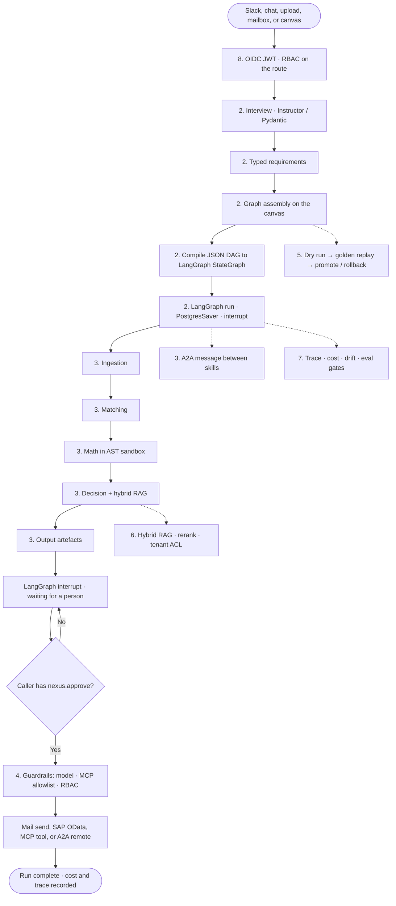

# Nexus 2.0 — Enterprise target (block guide)

Companion to `Nexus_Architecture_Enterprise.png` (from `Nexus_Architecture_Enterprise.html`). Each heading below is one box or chip on that picture.

**How to read a block:** three to four short paragraphs of what it is for, then the enterprise tech you would actually buy or run, then a two-line example. Green chips are the wider enterprise stack. Blue chips are **LangGraph, A2A, MCP and RAG**. The hand icon means a person must click.

**The whole picture in one breath:** work arrives at a door including Slack; answers become a typed JSON graph; that graph is **compiled into LangGraph** and run with checkpoints; five skills execute as LangGraph nodes and hand **A2A** messages; writers, SAP, MCP tools and remote agents fire only after RBAC and guardrails; the workbench tests then promotes; hybrid RAG supplies cited evidence; OpenTelemetry plus drift watch quality; OIDC and policy wrap every call; Kubernetes, Postgres, object storage and Vault sit underneath.

This file is the **LangGraph-as-runner** target. The later picture (`Nexus_Architecture_Enterprise_v2.png`) keeps the same product and de-emphasises LangGraph into an optional inner loop. Use this MD when you are explaining *this* HTML.

### Complete flow (how to read the picture)

Left-to-right on the PNG is the same path as this chart: a door, typed requirements, compile, a checkpointed LangGraph run, five skills, a human click, then a side effect. RAG, drift and identity sit *around* the run, not after it.

| Phase on the picture | What actually happens | If you skip it |
|---|---|---|
| 1 Touchpoints | Work enters through a door. Slack is inbound only | Unsigned Slack events; guessable downloads |
| 2 Orchestration | Interview → typed slots → JSON DAG → **LangGraph compile + run** | Crash loses the wait-for-approve; no resume |
| 3 Skills | Five specialists as LangGraph nodes; A2A on the envelope | Skills call each other; no agent card at the edge |
| 4 Reach-out | Writers, SAP, MCP, remote A2A — after guardrails | Duplicate POs; a tool result becomes an instruction |
| 5 Workbench | Design, dry-run, golden, then promote or roll back | A bad prompt ships on Friday |
| 6 Context / RAG | Chunk, embed, hybrid retrieve, rerank, tenant ACL | Decision has no citation a human can check |
| 7 Assurance + drift | Fleet: traces, $, drift flavours, eval gates | You find out at month-end close |
| 8 Identity | Who you are, what role, then rules on the record | Approve is only a button |
| 9 Foundation | FastAPI + LangGraph workers on Postgres / S3 / Redis | One pod restart is an outage |

---

## 1. Touchpoints

These are the doors into Nexus. Humans (chat, canvas, approve) stay in control. Systems (mail, Slack) must be signed or idempotent so the same event cannot start two runs. Slack on this picture is **inbound only** — it can open a session, not page an on-call (that would live under Assurance if you add it later).

Read the rail left to right as *how work is born*, not as a sequence every run must walk. Slack and chat are how a person talks to Nexus in plain language. File upload and mailbox are how documents arrive without anyone sitting at the canvas. Canvas edits are where the user still owns the JSON graph — LangGraph compiles that graph later; the user never draws a StateGraph. Approve is not intake; it is the RBAC control that releases mail or a SAP post. Artefact download is entitled, signed-URL access, not a guessable path on the API.

The enterprise shift versus today is that **each door already carries identity**. Slack is signature-verified and mapped to SSO. Chat is an authenticated API call, rate-limited so a loop cannot burn the model budget. Mailbox uses a vaulted identity. Approve requires `nexus.approve`. Without that, LangGraph in section 2 is just a more durable way to run unauthenticated work. System doors may *start* a run; they still may not *finish* a write — the hand icon on Approve is that rule.

### Slack message

A Slack event can start or continue a session: a prompt, a file, a status ask. Because Slack is untrusted workspace input, the request is signature-verified, mapped to a Nexus user via SSO, and then treated like a chat turn. Nothing in Slack can approve a SAP post — that still needs `nexus.approve` on the web (or a dedicated approve surface with the same scope).

**Enterprise tech:** Slack Bolt + Events API, least-privilege scopes. Alternative: Microsoft Teams Bot Framework if the customer is Teams-first.

**Example:** In `#ap-bots` someone writes `@nexus match last week’s invoices` and attaches a spreadsheet. Nexus opens a session as that person’s SSO identity.

### Chat prompt

The interview screen. A finance user types the goal and answers follow-ups. Every message is an authenticated API call, attributed to a user and a tenant, and rate-limited so a loop cannot burn the model budget. Chat is how a *new* flow is born; saved flows later start from the library, Slack or mail.

**Enterprise tech:** React SPA talking to FastAPI. Optional: SAP Fiori / Work Zone shell if Nexus must live inside the existing portal.

**Example:** Priya types “Match this month’s invoices to POs and flag variance over 5%.” The assistant asks which columns are the keys; a graph appears instead of a developer writing a job.

### File upload

Files no longer land on the application instance. The browser streams them to object storage with a size cap and a type allowlist. Spreadsheets, PDFs and mail attachments take this path; Unstructured / pypdf parse them later in ingestion, not at the door. Surviving a pod restart is the point.

**Enterprise tech:** Amazon S3 or MinIO (Azure Blob / GCS). Scan with ClamAV or a commercial storage scanner before a skill opens the object.

**Example:** Priya drops `invoices.xlsx`. It is stored as `s3://nexus-acme/sessions/s12/invoices.xlsx` and only then does ingestion see it.

### Mailbox

Unread inbox is still a real intake channel for supplier documents. Keep “read UNSEEN, then flag” because that is naturally idempotent. The mailbox identity is a vaulted technical user or a delegated Graph token — not a password in source. Failures become a metric, not a silent empty dashboard.

**Enterprise tech:** IMAP for generic mail. Enterprise options: Microsoft Graph (Exchange Online) or Gmail API.

**Example:** A vendor mails `invoice-441.pdf`. Nexus fetches that one message, flags it Seen, and starts (or attaches to) a run. The same message is not processed again tomorrow.

### Canvas edits

The canvas is still the product: a **user-authored** JSON graph, not a developer-compiled one. LangGraph compiles that JSON *at run time*; the user never draws a StateGraph. Enterprise adds revision numbers so two editors cannot silently overwrite.

**Enterprise tech:** React Flow on the client. Graph document in PostgreSQL with a revision. Conflict-on-stale-write is enough at first.

**Example:** Priya adds a Math node. Raj had the old graph open; his save is rejected with “reload, your version is stale.”

### Approve click (human gate)

This click releases a side effect — send mail or post a business document. It is a *control*: the caller must hold `nexus.approve`, the payload is hashed, the action is idempotent, and an audit row names the person. Builders can prepare the payload; they cannot fire it.

**Enterprise tech:** RBAC scope `nexus.approve` on the route, plus OPA/Cedar for amount limits. Audit to Postgres or a SIEM.

**Example:** The PO payload is ready. Raj the builder does not see an enabled Post button. Priya clicks once; a retry does not create a second PO.

### Artefact download

Artefacts are not guessable paths on the API. After an entitlement check, the API issues a short-lived signed URL and logs the issue. When the URL expires the file is still in the bucket but that link is dead. That stops “anyone with the run id can download the workbook.”

**Enterprise tech:** S3 / MinIO pre-signed URLs (or Azure SAS). Same pattern on GCS.

**Example:** Priya gets a five-minute link to `run_88.xlsx`. Forwarding it to a personal Gmail fails after expiry; the access log shows her user id.

The person icon under the rail is that human: design, confirm, approve.

---

## 2. Orchestration — LangGraph is the runner

Today a run lives inside one HTTP request. On this picture the canvas still *authors* a JSON graph, but **LangGraph** *executes* it: compile nodes to a `StateGraph`, write a checkpoint, interrupt for approval, stream tokens, resume after a crash.

This panel is the *plan and run* path, and on this HTML LangGraph is the outer engine — not an optional inner loop. Interview turns messy intake (chat, Slack, files, mail) into answers. Typed requirements freeze those answers into Pydantic slots so “same answers → same graph” stays true. Graph assembly still computes a **user-editable JSON DAG** and diffs it onto the canvas; a developer does not replace the product with a hand-written StateGraph. Compile is a derived step at **run** time: each skill placement becomes `add_node`, each exit port becomes a named edge, Approve becomes `interrupt`. The LangGraph run then checkpoints (PostgresSaver), streams to the UI, and can sit for days on that interrupt.

Why compile at all: the JSON graph is what a finance user can read and edit; the StateGraph is what a durable worker can resume after a kill. If compile fails (unknown port, a cycle), the run does not start — better than a silent hang. Side-effecting steps still carry an idempotency key so resume cannot double-post to SAP. Read the five boxes left to right as one pipeline. Skipping typed requirements is how a string leaks into a formula. Skipping compile/run is how you stay on today’s in-process HTTP runner.

| Step | Input | Output | Why it exists |
|---|---|---|---|
| Interview | Chat / Slack / file / mail | Slot-shaped answers | Model fills *values*, not the graph |
| Typed requirements | Those answers | Pydantic objects | Same answers → same graph |
| Graph assembly | Requirements | User-editable JSON DAG | The canvas remains the product |
| Compile to LangGraph | JSON DAG | `StateGraph` + named edges | Durable runner without rewriting skills |
| LangGraph run | Compiled graph | Checkpoints, interrupt, stream | Wait days for a human; resume after kill |

### Interview

A bounded question loop, grounded in whatever arrived at the door (upload, mail, Slack text). Each answer is requested as JSON against a schema, repaired if malformed, and refused if it is outside the domain. Token accounting per question stops a tenant from burning the budget in the interview itself.

**Enterprise tech:** Instructor (or native constrained decoding) + Pydantic on the way in. Completions through the model gateway.

**Example:** The file has columns `EBELN` and `WRBTR`. The assistant asks “which is the PO number?” Priya answers “EBELN.” A free-text essay is not accepted.

### Typed requirements

Interview answers become a small set of typed objects (match keys, formula, tolerance, output formats). If a value cannot be coerced to the schema, the turn fails loudly instead of leaking a string into graph assembly. That is what keeps “same answers → same graph” true when LangGraph, not a developer, will run the flow.

**Enterprise tech:** Pydantic v2 models shared by API, engine and storage. JSON Schema published so the UI and any A2A client use the same contract.

**Example:** Tolerance must be a number between 0 and 100. “about five percent” is rejected. Priya enters `5`.

### Graph assembly

Python still computes the desired node/edge list from those requirements and diffs it onto the canvas (progressive reveal). Enterprise does **not** replace this with a code-defined LangGraph, because the user must still edit it. What you add is storing the graph as a versioned row in Postgres rather than a file.

**Enterprise tech:** Existing Pydantic `Pipeline` / JSON DAG. Persistence in PostgreSQL JSONB. Canvas: React Flow.

**Example:** Two files + “match on PO and date window” produces Ingestion, Matcher, Math, Decision, Output, already wired. Priya can still delete Math.

### Compile to LangGraph

At **run** time the JSON DAG is compiled: each skill placement becomes `add_node`, each exit port becomes a named edge, the human gate becomes an `interrupt`. The user never sees this object. If compile fails (unknown port, cycle), the run does not start — better than a silent hang inside the worker.

**Enterprise tech:** `langgraph` `StateGraph.compile()`. Keep the JSON as the source of truth; the compiled graph is derived and disposable.

**Example:** Canvas has Matcher → Decision on port `matched`. Compile produces a StateGraph edge `matched`. Port `exceptions` is a different edge, not a Python `if`.

### LangGraph run

This is the execution engine on this picture. It loads the compiled graph, runs ready nodes, writes a checkpoint after each node (or level), streams tokens to the UI, and can sit for days on an approval interrupt. If the worker pod is killed, another worker resumes from `PostgresSaver`. Side-effecting steps carry an idempotency key so resume cannot double-post to SAP.

**Enterprise tech:** LangGraph + `PostgresSaver` (or the official Postgres checkpointer). `astream` for the UI. `interrupt` for Approve. Workers on Kubernetes.

**Example:** Matching finishes Friday 18:00. Priya approves Monday 10:00. LangGraph wakes from checkpoint “matching done” and only then calls Output and SAP. Friday’s work is not billed again.

---

## 3. Five specialist skills — each skill is a LangGraph node

Same five types as the current product. What changes is the wiring: a LangGraph node, an A2A skill card at the edge, MCP tools scoped per node, guardrails on the model, and the AST sandbox kept for formulas. Skills still **never call each other**. They emit a message; the graph edges decide who listens.

This is still the product’s heart: Ingestion, Matching, Math, Decision, Output. Enterprise does not invent new skill *kinds* on this picture. It changes how each placement is *hosted*. The left-hand **skill anatomy** box is the template: a LangGraph `add_node` with a checkpoint, an A2A skill card so a remote agent can discover the contract, MCP tools scoped *per node* (Matcher may not post to SAP), guardrails on model output, and the AST sandbox kept for user formulas — do not replace Math with an LLM “please compute variance.”

Named exit ports (`matched`, `residuals`, `exceptions`, `approved`, `flagged`, `escalated`) stay first-class. That is what keeps a run explainable and what lets you add a sixth skill later without rewriting the other five. Output still writes artefacts and then **interrupts**; mail and SAP are not fired here. Decision must cite hybrid-RAG passages; an ungrounded “approved” is a guardrail fail, not a silent pass.

The A2A bar under the five skills is the envelope **on the wire**. Internally it can stay a Pydantic object. At the process boundary it becomes an A2A task so a second agent (tax, credit, another Nexus) can participate without a private JSON dialect. Payload, exit port, RAG passages, schema, producer and run/task id are the fields a reviewer should be able to point at on the PNG.

### Skill anatomy

This left-hand box is the *template* every skill shares. A new skill (or a customer-supplied one) is supposed to drop in without rewriting the runner — which only works if these five pieces are always present.

#### LangGraph node

Each placement of a skill is one `add_node` with a checkpoint. Success, skip, or fail is recorded; the next node does not start until this one is durable. That is how resume works and how a trace stays honest.

**Enterprise tech:** LangGraph node + `PostgresSaver`. Same envelope in and out as today, mapped to A2A at the boundary.

**Example:** Matcher writes 8,000 matched rows and a checkpoint. The pod is OOM-killed. A new pod loads the checkpoint and starts Math. It does not re-score those 8,000 pairs.

#### A2A skill card

The public description of the skill: name, input schema, output schema, scopes. External agents discover it at `/.well-known/agent.json` (or the A2A Agent Card URL). Internally the same card is how the compiler knows which node can be placed. Without a card, a remote agent cannot legally call you.

**Enterprise tech:** A2A Agent Card (`a2a-sdk`). Serve from the API behind auth; do not put secrets in the card.

**Example:** ACME’s tax agent fetches Nexus’s Matcher card, sees input `kind=invoice_rows`, and sends a task. A random scraper hitting the well-known URL still needs a token.

#### MCP tools

Customer-specific tools (a SOAP service, an old file share) attached **per node**, not globally. Ingestion may call OCR-adjacent tools; Decision may not call `erp.vendor.write`. Output of a tool is stamped untrusted so it cannot be concatenated into a system prompt as instructions.

**Enterprise tech:** MCP SDK (`@modelcontextprotocol/sdk` or the Python SDK). Registry + egress allowlist. Alternative: a plain OpenAPI tool registry with the same scopes.

**Example:** Matcher may call `legacy.stock_on_hand`. A prompt-injection in the SOAP response cannot trigger SAP posting because posting is not in Matcher scopes.

#### Guardrails

Two checks before the next node sees the output. A model-output guard (jailbreak, missing citation, toxic/PII leak) and a policy guard (amount limits, segregation of duties). Failures become an `exceptions` / `flagged` envelope, not a crash.

**Enterprise tech:** NVIDIA NeMo Guardrails or Llama Guard / Azure Content Safety for model text. OPA or Cedar for business policy.

**Example:** The model returns “approved” with no passage id. Llama Guard / a groundedness check rejects it. The row leaves on `flagged` with reason `ungrounded`.

#### Formula sandbox

Kept from today on purpose. User formulas are parsed to an AST and evaluated against a whitelist — no `eval`, no imports. This is not the MCP sandbox; it is cheaper and stricter for math. Do not replace it with an LLM “please compute variance.”

**Enterprise tech:** Existing AST whitelist. Optional: a documented expression grammar so customers can code-review formulas.

**Example:** `abs(invoice_amt - po_amt) / po_amt` runs. Something that tries to read `/etc/passwd` never even parses.

### Ingestion

Reads structured files (pandas, openpyxl) and documents (Unstructured, pypdf), plus mail and Slack payloads. Schema is inferred, then confirmed in the interview. One default exit port — messy rows are still rows; Matching will sort them.

**Enterprise tech:** pandas + openpyxl as today. Unstructured / pypdf for documents. IMAP or Graph for mail bodies already fetched at the door.

**Example:** A Slack-attached CSV and a mailbox PDF both become tables with a `source` column. Matcher does not care which door they used.

### Matching

First the same deterministic match as today (keys, date windows, score). Then entity resolution against master data so “Acme Pvt” and “ACME PRIVATE LIMITED” can pair. Residuals and exceptions stay first-class ports so Decision never sees junk silently.

**Enterprise tech:** Keep the current matcher for the join. Optional LLM assist for fuzzy vendor names only. Master data: SAP MDG or the customer’s MDM.

**Example:** Invoice vendor text does not equal PO vendor text. Both resolve to the same vendor id, so they pair on `matched`. A true unknown leaves on `exceptions`.

### Math

Unchanged in spirit: the user writes a formula, the engine compiles it to a safe expression. Record the compiled form on the trace so an auditor can see *exactly* what ran. No Python, no lambdas, no attribute access.

**Enterprise tech:** Existing AST whitelist (the anatomy chip above).

**Example:** `abs(invoice_amt - po_amt) / po_amt` writes `variance`. The trace stores the compiled expression next to the result.

### Decision

The verdict is not “the model’s opinion.” It must cite hybrid-RAG passages (section 6). A guardrail rejects ungrounded or policy-breaking verdicts. Ports stay `approved` / `flagged` / `escalated` so routing stays explicit.

**Enterprise tech:** Hybrid retrieval + LLM via the model gateway. Llama Guard / NeMo on the verdict. Optional: a rules engine (Drools, SAP BRFplus) *alongside* the LLM for hard limits.

**Example:** Variance is 8%. Passage `pol-12` says “over 5% needs review.” Output: `flagged`, citation `[pol-12]`. Priya can disagree; that disagreement becomes an eval label.

### Output

Writes the themed workbook and branded PDF, then LangGraph **interrupts**. Mail and SAP are **not** fired here. That wait is a first-class interrupt so reminders, expiry and delegation can be configured later.

**Enterprise tech:** openpyxl + ReportLab. Interrupt via LangGraph. Artefacts in S3 / MinIO.

**Example:** `run_88.xlsx` and `run_88.pdf` exist. Dashboard shows “waiting for Priya.” Until she clicks, SAP has no new PO.

### A2A message — what moves between skills and outside agents

The envelope is still the only thing skills pass. Internally it can stay a Pydantic object. At the **process boundary** it is mapped to an A2A task so a second agent (tax, credit, another Nexus tenant) can participate without a private JSON dialect.

| Field on the picture | Role | On the A2A wire |
|---|---|---|
| payload | The rows / record | A2A data part |
| exit port | Which edge to follow | Task metadata |
| RAG passages | What Decision was allowed to use | Cited artefact |
| schema | How to parse the payload | Part content-type |
| producer | Which skill / agent emitted it | Agent card id |
| run / task id | Correlation for resume and audit | A2A context / task id |

#### payload

The rows or the record being worked on. Large payloads should be a reference to object storage, not a multi-megabyte JSON in the LangGraph state.

**Example:** Matcher emits `{ "kind": "matches", "rows": [ ... ] }` or `{ "ref": "s3://.../r88-matched.json" }` when over the size threshold.

#### exit port

Named door: `matched`, `residuals`, `exceptions`, `approved`, `flagged`, `escalated`, `default`. The next edge listens to one port. Wrong port means the packet is not delivered and the target is skipped with a reason.

**Example:** A bad row leaves Matcher on `exceptions`. Decision never sees it. Output’s “exceptions” sheet does.

#### RAG passages

The chunks the decision (or any reasoning step) was allowed to use. This is what makes “grounded” testable in eval. Empty cite list + `approved` is a guardrail fail.

**Example:** Decision lists `chunk:pol-12`. Eval checks that `pol-12` actually contains the 5% rule.

#### schema

Content-type / JSON Schema id of the payload. Receivers reject unknown schemas instead of guessing columns.

**Example:** Matcher advertises `application/vnd.nexus.matches+json`. A remote agent that only accepts invoices refuses the task cleanly.

#### producer

Which skill or remote agent emitted this message. Needed for audit and for “do not let Decision rewrite Matcher’s rows.”

**Example:** Envelope `producer=matcher@1.4`. Decision may add a verdict field; it may not change `vendor_id`.

#### run / task id

Correlation for traces, cost, audit and LangGraph resume. Natural A2A `taskId` / `contextId` when the package goes on the wire.

**Example:** Every envelope on this execution carries `run_id=r_88`. Grafana and the A2A task list both filter on that.

---

## 4. What a skill can reach out to

These are side effects and lookups. Built-in writers stay. **MCP and A2A** are how new systems plug in. Guardrails sit in front of every write. Mail and SAP still wait for Approve.

This panel is everything *outside* the five skills. The top row is what you already have in spirit (workbook, PDF, mailbox read, mail send, SAP OData, model gateway) brought up to enterprise rules: object store + hash for artefacts, Vault for secrets, idempotency on SAP, LiteLLM as the choke point for cost and keys. The middle row is the **plug-in plane**: Nexus as MCP client and as MCP server, a tool registry with allowlists, outbound A2A to remote agents, Agent Card discovery, and a business-event bus so nothing polls. The long bar is not a system; it is three doors, because three failure modes exist — model output, tool call, and dispatch.

Split chips into **reads / generate** (workbook, PDF, mailbox read, model completion) and **writes** (mail dispatch, SAP). Reads can happen during the run. Writes need `nexus.approve`. A tool result is always **data**, never an instruction. MCP is how a customer SOAP service shows up without a Nexus release; A2A remote is how a sister agent scores credit without sharing a database. If this panel is weak, you get duplicate POs, a tool result concatenated into a system prompt, or a builder who can post to SAP because Approve was only a button.

| Kind | Examples on the picture | Needs human gate? |
|---|---|---|
| Read / generate | Workbook, PDF, mailbox read, model gateway | No |
| Write | Mail dispatch, SAP OData | Yes — `nexus.approve` |
| Plug-in | MCP client/server, tool registry, A2A remote, events | Write tools: yes |

### Workbook writer

Spreadsheet the controller actually reviews. Enterprise writes it to object storage and records a hash on the run so the downloaded file can be proven to be *that* artefact.

**Enterprise tech:** openpyxl as today. Optional template layer (Carbone, Jasper, customer `.xlsx`).

**Example:** `run_88.xlsx` hash is stored. If someone tampers with a copy and emails it, the hash will not match the run record.

### Document writer

Branded PDF of the same result. Same object-store and hash rules as the workbook.

**Enterprise tech:** ReportLab as today. Same optional template service as the workbook.

**Example:** `run_88.pdf` lands next to the xlsx. Priya’s signed URL covers both after Approve of the *download*, which is separate from Approve of SAP.

### Mailbox read

The *capability* behind the mailbox touchpoint: fetch UNSEEN, flag, attach to a session. Keep it here so a skill can also pull a thread mid-run (for example a supplier reply) without inventing a second IMAP client.

**Enterprise tech:** IMAP, or Microsoft Graph / Gmail API. Secrets in Vault.

**Example:** During matching, a late credit-note arrives. Ingestion’s mailbox read picks the new UNSEEN message and a second Ingestion node is not required.

### Mail dispatch (human gate)

Sending is a capability behind Approve + RBAC. Enterprise adds bounce handling and a send-retry policy. Prefer “send as the user” where the mail platform supports it.

**Enterprise tech:** SMTP as the lowest common denominator. Microsoft Graph sendMail or Gmail API. Secrets in Vault.

**Example:** Priya clicks Send. Graph API sends from `priya@acme.com`. If Graph is down, the run shows `dispatch_failed`, not a silent log line.

### Business write-back (human gate)

Create or read S/4 documents (PO, GR, invoice) through public OData. Credentials live in Vault / BTP Destination. An idempotency key plus a local ledger prevent a retry from creating a second document. The call should carry the approver’s identity (token exchange), not a shared technical user, when the landscape allows it.

**Enterprise tech:** SAP S/4 OData via httpx / SAP Cloud SDK. Principal propagation or OAuth2 SAML bearer. Idempotency ledger in Postgres.

**Example:** After Priya approves, Nexus POSTs one PurchaseOrder with key `r_88:row_17`. A network retry returns the existing `4500008888`, not a duplicate.

### Model gateway

All completions and embeddings go through one place so cost, routing and keys have a choke point. Skills never embed an API key. Fail over Gemini ↔ SAP AI Core without the skill knowing.

**Enterprise tech:** LiteLLM, or SAP Generative AI Hub / Vertex / Azure OpenAI behind the same internal `LLMProvider` interface.

**Example:** Decision asks for a completion. Gateway records 4,200 tokens, $0.11, model `gemini-…`. ACME’s monthly cap is updated. The skill only sees the JSON verdict.

### MCP client

Nexus *calls* someone else’s tools. Each call is scoped to the node, allowlisted for egress, and treated as data. This is how a customer SOAP service shows up without a Nexus release.

**Enterprise tech:** MCP client SDK. Egress via network policy. Alternative: OpenAPI client with the same registry.

**Example:** Matcher calls `legacy.stock_on_hand` for material `100-200`. The tool cannot open `*`. The result is a number on the row, not a new instruction.

### MCP server

Nexus *exposes* itself as tools so an outer agent (or SAP Joule, or a customer GPT) can start a packaged flow, fetch status, or pull an artefact — still through OIDC and RBAC. Approve is never an MCP tool without the same `nexus.approve` check.

**Enterprise tech:** MCP server SDK in front of FastAPI. Same auth as the HTTP API.

**Example:** A Joule skill “run month-end match” maps to `nexus.flows.run`. It cannot map to `sap.post` unless the calling user holds approve.

### Tool registry + allowlist

The catalogue of MCP (and OpenAPI) tools: schema, owner, scopes, network allowlist. A node may only check out tools listed on it. This is the difference between “MCP is enabled” and “MCP is governed.”

**Enterprise tech:** Registry table in Postgres. OPA on checkout. Egress allowlist in the mesh / NetworkPolicy.

**Example:** Decision asks for a tool not on its node. Registry returns 403. The model cannot “just call SAP” because SAP is not in the list.

### A2A remote agents

Outbound: Nexus sends an A2A task to another agent (credit, tax, a sister Nexus). Timeouts, retries and the result-as-data rule still apply. The remote agent is not on your LangGraph; it is a side call from a node.

**Enterprise tech:** `a2a-sdk` task send. mTLS or OIDC client-credentials to the peer.

**Example:** Decision sends `credit.score` for `SUP-441` to ACME’s credit agent. The reply is a score + citation, stamped untrusted, then guardrailed.

### Agent discovery

How you find that peer: fetch its Agent Card, cache it, refresh on a TTL. Do not hardcode URLs in skill YAML. Cards are authenticated; a public well-known URL without auth is a directory, not an open door.

**Enterprise tech:** A2A Agent Card fetch. Optional internal catalog of approved peers (allowlist of card URLs).

**Example:** On startup the worker refreshes `https://credit.acme.internal/.well-known/agent.json`. An unknown host is refused even if a prompt names it.

### Business events

The bus for “run completed,” “document created,” and inbound work. Enterprise uses this so downstream systems do not poll Nexus. Delivery is at-least-once; consumers must be idempotent (same as SAP posting).

**Enterprise tech:** NATS JetStream or Kafka (MSK / Confluent). SAP Event Mesh when the landscape is SAP-centric.

**Example:** After PO `4500008888` is created, Nexus publishes `nexus.document.created`. The warehouse system creates an inbound delivery without calling Nexus.

### Guardrails bar (the long chip)

This is not a system; it is the *door* every system above must pass. Three places, because three failure modes exist:

| Place | What it stops | Tech |
|---|---|---|
| Model output | Jailbreak, ungrounded verdict, PII in the completion | NeMo Guardrails / Llama Guard |
| Tools | A tool calling anything, or a tool result treated as instructions | MCP allowlist + OPA |
| Dispatch | A builder posting to SAP, or a retry double-posting | RBAC `nexus.approve` + idempotency ledger |

A tool result is always **data**, never an instruction. A write never fires without an approver token.

**Example:** Output wants to post a PO of 2 crore. OPA says “two approvers required.” Llama Guard has already dropped an ungrounded “just approve it.” The ledger key `r_88:row_17` makes a retry safe.

---

## 5. Assembly workbench — design, test, then promote

A save is not “go live.” This panel is the software-delivery lifecycle applied to *flows*, not only to application code.

Nexus without a workbench is a notebook: someone edits a graph, hits run, and production is whatever was on their canvas. On this picture a flow moves **draft → approved → live**, and you can point live back at the previous pin. **Chat + Slack intake** is how a builder *authors* a flow (still inbound Slack, not a page). **Generated config** means one JSON Schema drives UI, API and validation. **Canvas edit** is the same React Flow surface, now with a visual diff. **Dry run** executes on a sample with SAP and mail refused. **Golden replay** is a production run a reviewer marked correct — a prompt tweak that changes those 12 flags fails promote until a human accepts the new baseline. **Promote / rollback** moves the pointer; it does not un-create SAP documents.

Read the chips as a pipeline, not a menu. Skipping dry run is how you discover the date window at close. Skipping golden is how a Friday prompt change ships. Skipping rollback is how you have no brake. Eval and drift in section 7 are what should *feed* promote even when this HTML does not draw a separate “release gate” chip — otherwise promote is a button with no evidence.

### Chat + Slack intake

The workbench reuses the same two human doors to *author* a flow, not only to run a packaged one. Slack here is still inbound: “help me build the match flow,” not a page.

**Enterprise tech:** React + Slack Bolt, same as touchpoints, with `nexus.build` required.

**Example:** Priya starts in Slack, finishes the interview on the web canvas. One session, one graph.

### Generated config panel

One JSON Schema drives the UI, the API and validation. Changing a match key does not require a React rewrite. Enterprise adds who-changed-what on the revision.

**Enterprise tech:** JSON Schema → form. Revisions in Postgres.

**Example:** Schema says `tolerance` is a number 0–100. The panel will not let Priya type “tight.”

### Canvas edit

Same React Flow canvas as the touchpoint, used here as the *editor* after generation. Visual diff against the previous revision is what a reviewer actually looks at.

**Enterprise tech:** React Flow. Reuse the existing graph-diff logic.

**Example:** Diff view shows “Math formula changed from 3% to 5% by Priya at 14:02.” Raj can restore 3% in one click.

### Dry run

Executes on a sample with writers allowed and **SAP/mail refused**. Counts and exception ports are visible so a wrong key is found before month-end. Skills do not each implement a fake mode; the capability layer honours `dry_run=true`.

**Enterprise tech:** Same LangGraph runtime with a capability policy “deny all side effects.” Sample cap (e.g. 200 rows) in config.

**Example:** Dry run reports 180 matched, 12 residuals, 3 exceptions. Priya fixes the date window. No PO exists in SAP.

### Golden replay

A production run that a reviewer marked “this is correct” becomes a fixture. On every prompt, model, or behaviour change, the fixture is replayed and differences are a blocking review, not a silent ship.

**Enterprise tech:** Stored inputs/outputs in object storage + a CI job. Comparison in pytest plus a small eval harness. Optional: promptfoo or LangSmith datasets.

**Example:** Golden `gr_12` must still flag the same 12 invoices after a Decision prompt tweak. Two new flags appear → promote fails until a human accepts the new baseline.

### Promote / rollback

Draft → approved → live. Live pointer moves back to the previous pinned graph + behaviour versions. No rebuild. You do not “un-create” SAP documents; you only stop the bad definition from running again.

**Enterprise tech:** `live_version` column on the flow. One authenticated API. Optional feature-flag kill switch as a faster emergency brake.

**Example:** `matcher@1.5` over-matches. Ops sets live to `1.4`. In-flight LangGraph runs finish (or cancel); new runs use 1.4.

---

## 6. Context fabric · RAG

This is everything a reasoning step is allowed to know. Retrieval is **entitled, hybrid, and measurable**. Quiet misses (wrong clause, no citation) are how a grounded system loses trust, so this panel exists to make those misses visible.

Decision is only as good as the pack it is allowed to see. Today that pack is whatever happened to be in the prompt. On this picture the pack is a pipeline: parse and chunk with stable ids, embed through a recorded model, store in a tenant-scoped vector index, retrieve hybrid (BM25 + dense, fused with RRF), rerank the shortlist, optionally walk a knowledge graph for entities and prior flags, and **filter every query by tenant ACL**. Hybrid is the default, not an extra. Vectors alone miss PO numbers. Keyword alone misses “overdue” vs “beyond thirty days.” The graph is not a second copy of Postgres rows; it is the *links* Matching and Decision can share.

Entitlement is the chip that makes the others safe. If the index is global and you filter in Python, you will eventually skip the filter. Row-level and collection-level tenant labels are the design. Section 3 Decision consumes this pack (and must cite it). Section 7 eval scores whether those cites were real. An ungrounded “approved” is a guardrail failure, not a successful retrieve.

| Stage | Job | Typical tech |
|---|---|---|
| Parse & chunk | Text with headings, stable chunk ids | Unstructured, pypdf |
| Embeddings | One vector per chunk, via the gateway | sentence-transformers or a hosted embed model |
| Vector index | Dense search, tenant-scoped | Qdrant or pgvector |
| Hybrid retrieval | Lexical + dense, fused | BM25 + dense + RRF |
| Rerank | Precision on the shortlist | Cross-encoder on the model gateway |
| Knowledge graph | Entities and links, not only similar text | Neo4j or RDF |
| Tenant corpus | ACL on every query | Row labels + the same OPA decision |

### Parse & chunk

Heading-aware split so a policy clause stays a clause. Chunk ids stay stable so a citation from last month still resolves after a re-index. pypdf covers native PDFs; Unstructured covers messier office files.

**Enterprise tech:** Unstructured + pypdf as on the chip. Layout-aware `hi_res` when scans appear.

**Example:** Policy PDF becomes 40 chunks. Chunk `pol-12` is “variances beyond 5% need review,” not half of page 3 mixed with the footer.

### Embeddings

One embedding per chunk, computed through the **model gateway** so cost and model version are recorded. Embeddings are tenant-scoped keys in the vector index. Re-embedding after a model change is a gated job, not a silent background rewrite.

**Enterprise tech:** sentence-transformers self-hosted, or a hosted `text-embedding` deployment on AI Core / Vertex / Azure via LiteLLM.

**Example:** `pol-12` embedding is stored under `tenant=acme`. ACME cannot retrieve BU-2’s vectors even if the bytes sit on the same cluster.

### Vector index

Dense search for paraphrase (“overdue” vs “beyond thirty days”). Always combined with lexical search later; vectors alone are weak on PO numbers and account codes.

**Enterprise tech:** Qdrant, or pgvector on the same Postgres if the corpus is modest. OpenSearch k-NN as a third option.

**Example:** Query “late invoices” returns `pol-12` (“beyond thirty days”) at high score even though the words differ.

### Hybrid retrieval

At query time: lexical hits (BM25) plus vector hits, fused with RRF, then handed to rerank. The decision skill does not know which retriever fired. This is the default enterprise pattern — not “vectors only.”

**Enterprise tech:** BM25 in OpenSearch / Postgres FTS + dense in Qdrant/pgvector. Fusion: RRF in a small library (or LlamaIndex/Haystack-style).

**Example:** PO number `4500001234` is a lexical hit. “late payment policy” is a vector hit. Both make the shortlist.

### Rerank

A cross-encoder (or a small LLM-as-reranker) reorders the fused shortlist under a token budget before packing cites into the A2A message. Cheap retrieve, expensive rerank on 20 chunks, not on 2 million.

**Enterprise tech:** Cross-encoder via the model gateway. Alternative: Cohere Rerank / a Vertex ranking model.

**Example:** Twenty candidates go in; five cites come out, `pol-12` first. Decision’s prompt never sees the other fifteen.

### Knowledge graph

The entity/relationship store: vendors, POs, prior flags. Queried with tenant isolation. This is what Matching can use for identity and what Decision can use for “has this vendor been flagged before?” It is not a second copy of Postgres rows; it is the *links* between them.

**Enterprise tech:** Neo4j (Aura or self-hosted) with Cypher. Alternative: RDF stack (Stardog / AllegroGraph) if they already have one.

**Example:** `SUP-441` —HAS_PO→ `4500001234` —MATCHED→ `INV-9` —FLAGGED_ON→ `2026-08-14`. Decision asks “flags this quarter?” in one hop.

### Tenant corpus

Every retrieve — vector, graph, lexical — is filtered by tenant and document ACL. A brilliant index that leaks another BU’s policy is a failed design. This chip is the policy; the stores above must enforce it.

**Enterprise tech:** Row-level security in Postgres, tenant labels in Qdrant/Neo4j, and the same OPA decision the API uses.

**Example:** Two business units share a Nexus install. Priya’s Decision cannot retrieve BU-2’s side letter even if the embedding is the nearest neighbour.

---

## 7. Assurance + drift

One run is already explainable today: you can open the dashboard and see which node ran. That is **debugging one execution**. This panel is the **fleet** — every tenant, every flow version, every model — plus an explicit **drift** block so quality slip is not anecdotal.

Assurance is how Nexus becomes something you can *operate*, not only something you can demo. On this HTML the questions a controller will actually ask are: where did the time go, is the fleet healthy, what did it cost, and did quality quietly change. Tracing answers the first (OpenTelemetry, including `gen_ai` spans). Metrics and alerts answer the second (Prometheus / Grafana). Cost per run answers the third (tokens on the model gateway, rolled to skill / run / tenant, with a budget that can refuse new runs). Drift plus eval-and-gates answer the fourth.

Drift is the easy one to miss: production still returns 200, but reviewers disagree more, or the provider swapped weights behind the same model name, or the files changed shape. This picture splits drift into **input**, **model** and **override-rate** so you do not rollback the matcher when vendors simply started sending scans. Alert a human; do not auto-block month-end. Eval is the exam you run on purpose (Ragas / golden replay); it is also what should block promote in the workbench. Workbench **uses** these numbers even when the gate is drawn as “eval & gates” rather than a separate chip.

Think of four questions:

1. **Where did the time go?** (tracing)
2. **Is the fleet healthy?** (metrics and alerts)
3. **What did it cost?** (cost per run)
4. **Did quality quietly change?** (drift flavours + eval gates)

| Chip | Produces | Consumed by | If it goes red |
|---|---|---|---|
| Tracing | Spans: skill, model, tokens, run id | Metrics, cost, incident review | Open the trace, fix the slow span |
| Metrics & alerts | p95, error rate, queue age | On-call, promote decision | Page or freeze promote |
| Cost per run | Tokens × price per skill / run / tenant | Budget cap, FinOps | Refuse new runs |
| Drift monitor | Change vs a rolling baseline | Humans, rollback | Alert; do **not** auto-block live |
| Input / model / override drift | Which flavour moved | The monitor above | See table below |
| Eval & gates | Scores on a labelled set | Promote / rollback | Keep the old live pin |

### Tracing

A span from the browser action through FastAPI, LangGraph, each skill, each model call, each SAP/HTTP call. Attributes include tenant, run id, model name, token counts, LangGraph checkpoint id. This is what makes a 2 a.m. incident diagnosable without SSH.

**Enterprise tech:** OpenTelemetry SDK → OTel Collector → Grafana Tempo / Jaeger / Honeycomb / Datadog. Use the `gen_ai.*` semantic conventions for model spans.

**Example:** “Why 40 seconds?” Trace shows Decision LLM 35s, 2 retries, 8k input tokens. Matcher was 2s. You fix the prompt size, not the matcher.

### Metrics & alerts

The operational dashboard: run success, p95, queue age, SAP error rate. Breach pages someone. Without this, “it feels slower this month” is a hallway conversation.

**Enterprise tech:** Prometheus histograms, Grafana, Alertmanager. Same signals can feed the eval gate.

**Example:** After a model upgrade, Decision p95 goes 6s → 18s. An alert fires. Promote of that pin is already unsafe.

### Cost per run

Tokens × price, rolled to skill, run, tenant. A budget can refuse *new* runs. History starts the day you instrument the gateway; it cannot be backfilled, which is why this is an early item.

**Enterprise tech:** LiteLLM callbacks into Prometheus + a billing table. Optional FinOps export.

**Example:** ACME is at $480 of $500. Next run is estimated $30. Runtime refuses with “budget.” Priya sees it on the dashboard, not as a mystery 500 error.

Roll-up order finance actually uses: **skill → run → flow version → tenant → month**.

### Drift monitor

Drift is “the system is not the system you tested.” Production keeps returning 200. Humans just disagree more, or the provider swapped weights, or the files changed shape. Catch it against a **rolling baseline** (last 4–6 weeks of the same flow), not a wiki number. Alert a human; do not auto-block month-end.

**Enterprise tech:** Evidently, WhyLabs, or a thin job on the trace store. Model version recorded on every span.

**Example:** Override rate on Decision was 4% for six weeks, this week 18%, inputs unchanged. Drift alert. You roll back the prompt before close.

### Input drift

Schema, volume, language, or file mix moved. Matching a new column layout with last quarter’s keys will look like “the matcher got worse” if you do not split this flavour out.

**Enterprise tech:** Schema-diff on ingestion, row-count histograms, Evidently data-drift reports.

**Example:** Vendors start sending scans instead of XLSX. Ingestion schema-diff fires. You do not blindly rollback matcher@1.4.

### Model drift

The provider changed weights behind the same name, or you changed the pin and forgot. Every span must record `model_version`. A name like `gemini-flash` is not a pin.

**Enterprise tech:** Pin + version on the gateway. Evidently / a custom job comparing output distributions on a frozen set.

**Example:** Gateway shows `model_version` jumped overnight with no Nexus release. Eval on the golden set is re-run before the next promote.

### Override-rate drift

The honest quality signal: reviewers disagree more. The human gate is already labelling you (approve / edit / reject). If override rate climbs and inputs did not, the prompt or the model slipped.

**Enterprise tech:** A metric on Decision outcomes vs the human’s final action. Alert on a threshold (e.g. 4% → 12%).

**Example:** Priya used to accept 96% of flags. This week she recodes 18%. You roll back Decision’s prompt, not SAP.

| Flavour | What moved | How you see it | What you usually do |
|---|---|---|---|
| Input | Schema, volume, scan vs xlsx | Ingestion schema-diff, counts | Fix catalog / parsing; do not ship blindly |
| Model | Weights or pin changed | `model_version` on spans | Pin the old revision; re-run eval |
| Override-rate | Humans disagree more | Approve vs edit vs reject | Rollback prompt or behaviour pin |

### Eval & gates

Scored tests of the probabilistic half: extraction accuracy, match precision/recall, verdict agreement, groundedness of citations. Labels come from Approve / edit / override already captured. Deterministic math stays in pytest. The **gate** is: golden replay + these scores must stay within a band of live, or promote fails.

**Enterprise tech:** Ragas or DeepEval for groundedness. Custom scores in CI. Golden fixtures in object storage.

**Example:** Extraction F1 on vendor name drops from 0.95 to 0.81 on the nightly set. Promote fails. The new model does not ship.

---

## 8. Identity and policy

This panel wraps the blue box. If it is weak, every other enterprise chip is weaker: you cannot entitle RAG, you cannot propagate SAP identity, you cannot prove who approved.

Identity here is a stack, not a login screen. **Sign-in (OIDC)** answers “who is this person” against the customer’s IdP — Keycloak, Auth0, Entra or SAP IAS; Nexus has no password database. **RBAC scopes** answer “which routes may they hit” with a small set: view, build, run, approve. Approve on the route is what turns the human gate into a control. **ABAC / OPA / Cedar** answers “may they do this *to this record*” when amount, plant or data class matter — a role named approve is not enough for a 2-crore PO. **Secrets** (Vault) are where SAP, mail, LLM and Slack credentials live, rotated, never in git. **Acting user outbound** is token exchange / principal propagation so SAP’s log shows Priya, not `NEXUS_TECH_USER`. **Tenant filter** is the last line of defence on every query — prefer row-level security so a missing `WHERE` is a database error, not a leak.

The wrapping is literal on the PNG: every arrow into the blue box is supposed to have already passed this panel. Mixing these checks into skill code is how the next skill forgets them. Slack, canvas and Approve all depend on the same JWT; they must not invent a second identity.

### Sign-in

Delegated login to the customer’s IdP. Nexus validates signature, audience, expiry. No password database. Tokens are short-lived; refresh is explicit. This is also how Slack and the canvas know it is Priya.

**Enterprise tech:** Keycloak (self-hosted), Auth0/Okta, Microsoft Entra ID, or SAP IAS/XSUAA. Authorization Code + PKCE for the SPA, JWT on the API.

**Example:** Priya clicks Login, lands on ACME Entra, returns with a JWT `aud=nexus`. An expired token cannot start a run.

### RBAC scopes

Coarse roles on routes: view, build, run, approve (and administer). Keep the set small. Approve on the route is what turns the human gate into a control. A user can hold more than one role; “cannot approve own submission” is ABAC, not another role.

**Enterprise tech:** Roles in the IdP (groups → scopes). Enforced in FastAPI dependencies. Optional: SAP role collections if IAS is the IdP.

**Example:** Raj in group `nexus-builders` can edit the canvas and dry-run. The `/sap/post` route still returns 403.

### ABAC / policy

When the answer depends on the *record* (amount, plant, data class), a role is not enough. A policy engine evaluates JSON (principal + action + resource) and the decision is logged. Rules are files, not `if` statements scattered through skills.

**Enterprise tech:** Open Policy Agent (Rego) or Cedar. Alternative: SAP Authorization + a thin overlay for amount limits.

**Example:** Policy: `approve` allowed if `amount < 100000` OR `second_approver`. A 2-crore PO waits for a second token even though Priya has the approve role.

### Secrets

SAP, mail, LLM and Slack credentials are injected at runtime, rotated, and audited. A CI scanner fails the build if a secret pattern hits git. Anything that was ever in a Python module is rotated as a one-off.

**Enterprise tech:** HashiCorp Vault, or cloud: AWS Secrets Manager, Azure Key Vault, GCP Secret Manager, SAP Credential Store.

**Example:** SAP client secret rotates every 30 days. Nexus picks up the new version on next refresh. Git history no longer contains a usable password.

### Acting user outbound

When Nexus calls SAP (or Graph), the call should show **Priya**, not `NEXUS_TECH_USER`. Token exchange (OAuth token exchange / SAP principal propagation) at dispatch time. That is what makes SAP’s own authorisation and audit apply.

**Enterprise tech:** OAuth 2.0 token exchange, or SAP principal propagation / SAML bearer. Fallback: a named technical user recorded on the run when the landscape cannot propagate.

**Example:** Run `r_88` carries `sub=priya@acme`. When the PO is created, SAP’s application log shows Priya.

### Tenant filter

Every query — Postgres, vector, graph, object list — includes the tenant. This is the last line of defence if a developer forgets a `WHERE`. Prefer row-level security so a missing filter is a database error, not a leak.

**Enterprise tech:** Postgres RLS. Tenant labels in Qdrant/Neo4j. The same `tenant` claim on the JWT.

**Example:** A buggy list-runs endpoint omits the filter. RLS still returns only ACME rows. The bug is a 500 in staging, not a cross-tenant incident.

---

## 9. Runtime foundation

The floor. FastAPI remains the application; **LangGraph + PostgresSaver** is the orchestrator; Kubernetes workers actually run the graph. Everything around that is what a security review and an SRE will ask for.

This panel is the answer to “where does this actually run on Monday,” not a shopping list of extra logos. The **Web API** stays thin: accept, authorise, stream. The **orchestrator** is the engine that compiles JSON → StateGraph, checkpoints, interrupts and resumes — if you later replace LangGraph with Temporal, this is the chip you swap; the JSON DAG and the five skills stay. **Workers** scale on queue age because month-end is a queue problem, not a hot API replica. **PostgreSQL** is the system of record (flows, sessions, checkpoints, audit, idempotency ledger) with PITR; Redis can be flushed, this cannot. **Files** (S3 / MinIO) hold bytes. **Redis** holds locks and SSE fan-out so two workers cannot both post the same PO. **Telemetry** is the pipe section 7 reads. **CI / CD** is signed, scanned images plus golden/eval before a digest reaches the cluster.

If you skip the split between API and workers, a run is still one HTTP request and a crash loses the wait-for-approve. If you skip Postgres checkpoints, LangGraph cannot resume. If you skip Redis locks, resume double-posts. If you skip telemetry, 2 a.m. is SSH. If you skip signed CI, `latest` is what production runs.

A single invoice-match walk:

1. **Web API** accepts the command (behind whatever ingress you already have).
2. **Orchestrator** compiles JSON → StateGraph and starts a run.
3. A **worker** executes nodes; checkpoints land in **PostgreSQL**.
4. Files go to **S3 / MinIO**; **Redis** holds locks and stream fan-out.
5. **Telemetry** records spans; **CI/CD** is what put this image in the cluster.

| Chip | Holds / does | If you skip it |
|---|---|---|
| Web API | REST + SSE, auth on every router | LangGraph is unreachable from the UI |
| Orchestrator | Compile + checkpointed run | One HTTP request = one run; crash loses the wait |
| Workers | Horizontal scale on queue age | Month-end is a single hot API replica |
| PostgreSQL | Flows, sessions, checkpoints, audit, ledger | JSON files; no tenant query; no resume |
| Files | Uploads, artefacts, golden fixtures | Bytes die with the pod |
| Redis | Locks, SSE pub/sub, short cache | Double SAP post; SSE stuck on one replica |
| Telemetry | The pipe section 7 reads | 2 a.m. SSH |
| CI / CD | Signed, scanned images + golden / eval | `latest` in prod; a CVE rides along |

### Web API

The Nexus REST/SSE API you already have, with auth dependencies on every router. Replicas stay *thin*: accept the command, write a run row, stream progress. They do not execute the graph. That split is what lets you patch the API without killing in-flight matching.

**Enterprise tech:** FastAPI + Uvicorn/Gunicorn, multiple replicas. OpenAPI spec published.

**Example:** `/runs/{id}/stream` still uses SSE, but the connection is authenticated and events come from Redis pub/sub because the worker is another pod.

### Orchestrator

LangGraph plus the Postgres checkpointer. This chip is the *engine*, not the HTTP process. Compile happens here; interrupt happens here; resume happens here. If you later move to Temporal, this is the chip you replace — the JSON DAG and the five skills stay.

**Enterprise tech:** LangGraph + `PostgresSaver`. Alternative if LangGraph is rejected: Temporal workflows wrapping the same nodes.

**Example:** Interrupt at Output. Worker dies. New worker loads checkpoint `after_decision` from Postgres and waits again. SAP was never called.

### Workers

Kubernetes jobs or a Deployment of LangGraph workers. Scale on **queue age**, not on CPU — month-end is a queue problem. A pod disruption budget so a deploy does not kill all in-flight work at once.

**Enterprise tech:** K8s Deployment + HPA on custom metric `queue_age`. PDB. Optional KEDA.

**Example:** 50 concurrent month-end runs. HPA goes 2 → 8 workers. API replicas stay at 3 because they are only accepting and streaming.

### Database

System of record for flows, sessions, runs, LangGraph checkpoints, audit, idempotency ledger. JSONB where the shape is open (graph, envelope extras). PITR enabled. Redis can be flushed; this cannot.

**Enterprise tech:** Amazon RDS / Azure Flexible Server / Cloud SQL / SAP HANA Cloud PostgreSQL. HA multi-AZ. PgBouncer.

**Example:** `SELECT status FROM run WHERE tenant='acme' AND day = CURRENT_DATE`. That query is impossible on today’s JSON files.

### Files

Encrypted blobs: uploads, artefacts, golden fixtures, fat A2A payloads. Lifecycle rules (cold storage after 90 days). The run row holds a URI, never the bytes.

**Enterprise tech:** S3, MinIO, Azure Blob, or GCS. SSE-KMS. Bucket policies deny public ACLs.

**Example:** A 200 MB upload never enters Postgres. The run row holds `s3://.../invoices.xlsx`.

### Cache / locks

Hot session fragments, progress pub/sub, distributed locks for idempotency, optional model-response cache. Persistence is optional; Postgres remains source of truth. The lock is what stops two workers from both posting the same PO after a resume.

**Enterprise tech:** ElastiCache / Azure Cache / Memorystore, or Redis Enterprise.

**Example:** Two workers receive the same resume message. Redis lock `sap:r_88:row_17` lets only one call SAP.

### Telemetry

Collector that receives OTel, scrapes Prometheus, and fans out to Grafana. This is the **pipe**; Assurance (section 7) is the **use** of the pipe. Emit OTel even if the backend is Datadog — so you are not stuck.

**Enterprise tech:** OTel Collector + Prometheus + Grafana. Managed: Grafana Cloud, Datadog, New Relic.

**Example:** One dashboard: run success, p95, $ / tenant, queue age, SAP error rate. The night on-call uses this, not log files.

### CI / CD

Build signed images, scan CVEs and secrets, run pytest + golden replay + eval, then deploy API and workers. Admission should refuse unsigned digests in prod.

**Enterprise tech:** GitHub Actions, GitLab, or Azure DevOps. Cosign/Sigstore. Trivy/Grype. Kyverno / OPA Gatekeeper.

**Example:** A dependency CVE critical fails the build. Even if someone tags `latest`, the cluster refuses the digest.

---

## Pocket card

Use this table as a one-page briefing after someone has walked the PNG. It does not replace the sections above; it is the sentence you want them to remember for each headline chip. Green is the wider enterprise stack. Blue is LangGraph, A2A, MCP and RAG. The hand icon still means a person must click. This is the **LangGraph-as-runner** target, not the current repo and not the later v2 picture.

| On the picture | Remember |
|---|---|
| Slack inbound | Starts a session; cannot approve SAP |
| LangGraph compile + run | JSON DAG is still user-authored; StateGraph is derived |
| PostgresSaver | Runs survive restart and can wait for a human |
| A2A message | Envelope on the wire when a second agent exists |
| MCP | Extra tools, allowlisted per node, result is data |
| Guardrails ×3 | Model output, tools, dispatch — three different failures |
| Human gate | Send and SAP post still need `nexus.approve` |
| Hybrid RAG | BM25 + dense + rerank; tenant ACL on every query |
| Drift | Input / model / override-rate — humans started disagreeing |
| OIDC / RBAC / ABAC | Who you are, what role, then rules on the data |
| Acting user outbound | SAP’s log shows Priya, not a shared technical user |
| Workers + Postgres + S3 + Redis | The floor LangGraph actually stands on |

This file describes the **target** on `Nexus_Architecture_Enterprise.png`, not the current code. The current-only picture is `Nexus_Architecture_Current.png`. The later, LangGraph-de-emphasised picture is `Nexus_Architecture_Enterprise_v2.png` (guide: `Nexus_Architecture_Enterprise_v2.md`).
