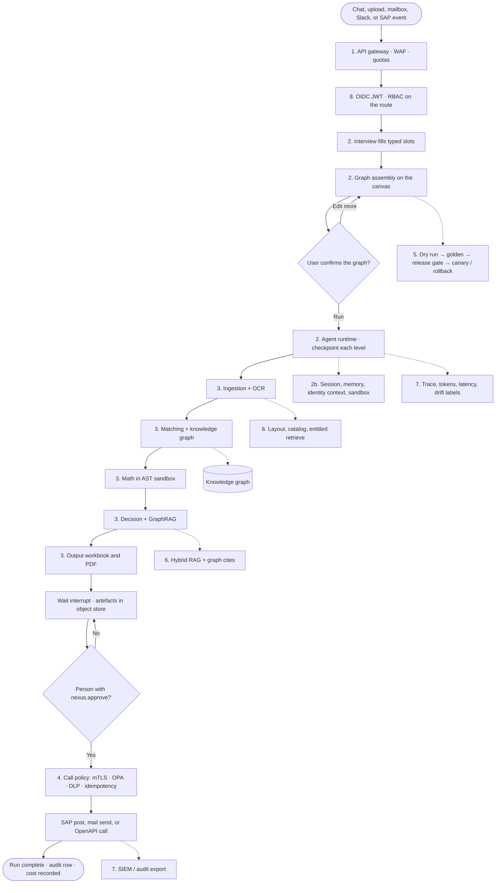

# Nexus 2.0 — Enterprise target v2 (block guide)

Companion to `Nexus_Architecture_Enterprise_v2.png`. Each heading below is one box or chip on that picture.

**How to read a block:** four short paragraphs of what it is for, then the enterprise tech you would actually buy or run, then a two-line example. Green chips on the picture are the wider platform. Blue chips are the new runtime, knowledge-graph, OCR and API layer. The hand icon means a person must click.

**The whole picture in one breath:** traffic hits an API gateway, the agent runtime interviews and runs a JSON graph with checkpoints, five skills execute (OCR on the way in, knowledge graph on match and decision), SAP or any API is called only after policy and a human approve, the workbench will not promote if quality or cost slipped, context supplies entitled evidence, assurance watches the fleet, and identity wraps every call.

### Complete flow (how to read the picture)

Left-to-right on the PNG is the same path as this chart: a door, a login, a plan, a checkpointed run, a human click, then a side effect. Assurance and the foundation are not extra steps — they sit *around* the run the whole time.

| Phase on the picture | What actually happens | If you skip it |
|---|---|---|
| 1 Touchpoints | Work enters through a door, always via the gateway | Unsigned Slack/SAP events, guessable downloads |
| 2–2b Runtime | Interview → JSON graph → durable run with a principal | Crash loses the run; no identity on SAP |
| 3 Skills | OCR in, KG on match/decision, sandbox on math, wait on output | Scans stay as blobs; verdicts are ungrounded |
| 4 Systems | Lookups and writes through one policy door | Duplicate POs, leaked PII in prompts |
| 5 Workbench | Dry run, golden, gate, flag, canary, rollback | A bad prompt ships on Friday |
| 6 Context | Entitled hybrid retrieve + graph | Decision cites the wrong BU’s policy |
| 7 Assurance | Fleet view: money, slowness, drift, eval | You find out at month-end close |
| 8 Identity | Who, what role, what the record is allowed to do | Approve is only a button |
| 9 Foundation | Where bytes, graphs, secrets and workers actually live | One pod restart is an outage |

---

## 1. Touchpoints

These are the doors into Nexus. In an enterprise build none of them talk to FastAPI directly: they all stop at an API gateway first, so TLS, quotas, a WAF and a login token are already in place before application code runs. If the door is a human (chat, canvas, approve), the person stays in control. If the door is a system (mail, Slack, SAP event), the payload is signed or idempotent so the same event cannot be replayed as a duplicate run.

Read the rail left to right as *how work is born*, not as a sequence every run must walk. Chat is how a **new** flow is designed in plain language. Upload, mailbox, Slack and a SAP webhook are how an **existing** packaged flow receives files or a seed id without another interview. Canvas is where the user still owns the graph — enterprise does not take that away. Approve is not intake; it is the control that later releases a side effect. Download is the last human door: entitled artefacts behind a short-lived signed URL, not a guessable path on the API.

The important shift versus today is that **identity is already on the request** before any skill runs. Slack is mapped to SSO, not to a shared bot user. A SAP event is signed or cert-authenticated. A mailbox uses a vaulted technical user or a delegated Graph token. That is what lets section 8 (RBAC / ABAC) and section 4 (idempotent SAP post) mean something. Without this rail, the blue box is a demo that anyone on the network can start.

Nothing on this rail auto-posts to SAP or sends mail. System doors may *start* a run; they may not *finish* a write. The hand icon under Approve is that rule made visible.

### Chat

This is the interview screen. A finance user types the goal in plain language and answers a few follow-up questions. The client is still a React app; the difference is that every message is an authenticated API call, attributed to a user and a tenant, and rate-limited so a loop cannot burn the model budget. Chat is how a *new* flow is born. Saved flows later start from the library, Slack or a SAP event, without another interview.

**Enterprise tech:** React SPA behind the gateway, talking to FastAPI. Optional: SAP Fiori / Work Zone shell if the customer wants Nexus inside their existing portal.

**Example:** Priya types “Match this month’s invoices to POs and flag variance over 5%.” The assistant asks which columns are the keys, she confirms, and a graph appears on the canvas instead of a developer writing a job.

### Upload

Files no longer land on the application instance. The browser streams them to object storage with a size cap and a type allowlist, then a scanner looks for malware before any skill is allowed to open the object. That is what makes uploads survive a pod restart and what stops a hostile PDF from executing inside the worker. Spreadsheets, native PDFs, scans and images all take this path; OCR happens later in ingestion, not at the door.

**Enterprise tech:** Amazon S3 or MinIO (or Azure Blob / GCS). Scan with ClamAV in the pipeline, or a commercial gateway such as Cloud Storage Security / Microsoft Defender for Storage.

**Example:** Priya drops a 40-page scanned invoice pack. It is stored as `s3://nexus-acme/sessions/s12/invoices.pdf`, marked `pending-scan`, and only after a clean scan does ingestion see it.

### Mailbox

An unread inbox is still a real intake channel for supplier documents. The enterprise version keeps “read UNSEEN, then flag” because that is naturally idempotent, but the mailbox identity is delegated or a dedicated technical user in a vault, not a password in source. Failures (mailbox down, auth expired) become a metric and an alert, not a silent empty dashboard.

**Enterprise tech:** IMAP as today for generic mail. Enterprise options: Microsoft Graph (Exchange Online) or Gmail API when the customer’s mail is in those clouds.

**Example:** A vendor mails `invoice-441.pdf`. Nexus fetches that one message, flags it Seen, and starts (or attaches to) a run. The same message is not processed again tomorrow.

### Slack

Inbound only on this picture: a Slack event can open a session, attach a file, or ask for status. It is not used here as the paging channel (that sits under Assurance). Because Slack is untrusted input from a workspace, the event is signature-verified, mapped to a Nexus user via SSO, and then treated like a chat prompt. Nothing in Slack can approve a SAP post — that still needs `nexus.approve`.

**Enterprise tech:** Slack Bolt + Events API, installed as a workspace app with least-privilege scopes. Alternative: Microsoft Teams Bot Framework if the customer is Teams-first.

**Example:** In `#ap-bots` someone writes `@nexus match last week’s invoices` and attaches a spreadsheet. Nexus opens a session as that person’s SSO identity and continues in Slack thread or in the web UI.

### SAP / webhook

This is how SAP (or any system of record) *pushes* work instead of Nexus polling. The body is signed or authenticated with a client certificate so a random caller cannot start a run. Overlap protection matters: the same goods-receipt id must not start two runs. This is the door that makes Nexus a participant in the customer’s event mesh rather than a batch tool.

**Enterprise tech:** SAP Event Mesh (or SAP Advanced Event Mesh). Generic alternative: HTTPS webhook on the API gateway with HMAC/signature verification, or Kafka consume if they already have a bus.

**Example:** Event `GoodsReceipt.Created` for material document 50001234 arrives. Nexus starts the packaged “3-way match” flow with that id as the seed, without anyone opening the UI.

### Canvas

The canvas is still the product: a user-authored graph, not a developer-compiled one. Enterprise adds optimistic concurrency (two editors cannot silently overwrite), version history, and a confirm step before a run. React Flow stays a good fit; what changes is that every edit is saved as an immutable revision against the user’s tenant.

**Enterprise tech:** React Flow on the client. Graph document in PostgreSQL with a revision number. Optional: CRDT/collaboration later; conflict-on-stale-write is enough at first.

**Example:** Priya adds a Math node and sets `variance = abs(inv - po) / po`. Raj had the old graph open; his save is rejected with “reload, your version is stale,” not a silent overwrite.

### Approve (human gate)

This click is what releases a side effect — send mail or post a business document. In enterprise it is a *control*, not a button: the caller must hold `nexus.approve`, the payload is hashed, the action is idempotent, and an append-only audit row names the person. Builders can prepare the payload; they cannot fire it. High-value posts can require a second approver via ABAC.

**Enterprise tech:** RBAC scope `nexus.approve` on the route, plus OPA/Cedar for amount limits. Audit to an append-only store (Postgres table or SIEM).

**Example:** The PO payload is ready. Raj the builder does not see an enabled Post button. Priya the approver clicks once; a second click or a worker retry does not create a second PO.

### Download

Artefacts are not served as guessable paths on the API. After an entitlement check, the API issues a short-lived signed URL to object storage and logs the issue. When the URL expires, the file is still in the bucket but no longer reachable with that link. This is how you stop “anyone with the run id can download the workbook.”

**Enterprise tech:** S3/MinIO pre-signed URLs (or Azure SAS). Same pattern on GCS. Gateway can add DLP inspection on download if the tenant requires it.

**Example:** Priya gets a five-minute link to `run_88.xlsx`. Forwarding it to a personal Gmail still fails after expiry, and the access log shows her user id.

The person icon under the rail is that human: design, confirm, approve.

---

## 2. Orchestration — the agent runtime runs the flow

Today a run lives inside one HTTP request. On this picture the canvas still *authors* a JSON graph, but an **agent runtime** *executes* it: plan the levels, write a checkpoint, wait for a human, resume after a crash. LangGraph is not the headline; it is an optional compiler if one node needs a bounded loop (that optional chip sits in 2b, not here).

This panel is the *plan and run* path. Interview turns messy intake into answers. Typed requirements freeze those answers into schema slots so “same answers → same graph” stays true. Graph assembly still computes a user-editable JSON DAG and diffs it onto the canvas — a developer does not replace the product with a code-defined graph. The agent runtime then loads that JSON, runs ready nodes, and can sit for days on an approval interrupt. The model router sits beside the runtime so every LLM call has a role, a cost budget and a latency budget, with failover, instead of each skill embedding its own key and model name.

Why a durable runtime at all: month-end matching finishes Friday, a person approves Monday, a worker pod is killed overnight. If the run is an HTTP request, all three of those are data loss or a double SAP post. Checkpoints plus an idempotency key are what make “wait for a human” an enterprise feature rather than a hung request. The JSON graph remains the source of truth the user can read; the runtime is only the engine that walks it.

Read the five boxes left to right as one pipeline. Skipping typed requirements is how a string leaks into a formula. Skipping the runtime is how you stay on today’s in-process runner. Skipping the model router is how a tenant’s spend becomes a surprise invoice.

### Interview

A bounded question loop, grounded in whatever arrived at the door (upload, mail, Slack, SAP event). Each answer is requested as JSON against a schema, repaired if malformed, and refused if it is outside the domain. Enterprise adds token accounting per question and a stop when the tenant budget is exhausted. The point is still the same: the model fills *values*, it does not invent the graph.

**Enterprise tech:** Structured output via the model gateway (JSON Schema / tool-calling). Pydantic validation on the way in. Optional: Instructor or native provider constrained decoding.

**Example:** The file has columns `EBELN` and `WRBTR`. The assistant asks “which is the PO number?” Priya answers “EBELN.” A free-text essay is not accepted; the slot is filled as a string field on the requirement object.

### Typed requirements

Interview answers become a small set of typed objects (match keys, formula, tolerance, output formats). If a value cannot be coerced to the schema, the turn fails loudly instead of leaking a string into graph assembly. That is what keeps “same answers → same graph” true when the runtime, not a developer, builds the flow.

**Enterprise tech:** Pydantic v2 models shared by API, engine and storage. JSON Schema published so the UI and any future A2A client use the same contract.

**Example:** Tolerance must be a number between 0 and 100. “about five percent” is rejected. Priya enters `5`, and graph assembly can now compute a Math node with a real threshold.

### Graph assembly

Python still computes the desired node/edge list from those requirements and diffs it onto the canvas (progressive reveal). Enterprise does not replace this with a code-defined graph, because the user must still edit it. What you add is pinning of behaviour versions on each node at package time, and storing the graph as a versioned row in Postgres rather than a file.

**Enterprise tech:** Existing Pydantic `Pipeline` / JSON DAG. Persistence in PostgreSQL JSONB. Canvas: React Flow.

**Example:** Two files + “match on PO and date window” produces two Ingestion nodes, Matcher, Math, Decision, Output, already wired. Priya can still delete Math if she does not want a variance column.

### Agent runtime

This is the execution engine. It loads the JSON graph, runs ready nodes, writes a checkpoint after each level, honours cancel, and can sit for days on an approval interrupt. If the worker pod is killed, another worker resumes from the last checkpoint. Side-effecting steps carry an idempotency key so resume cannot double-post to SAP.

**Enterprise tech:** A durable worker pool on Kubernetes (Temporal is the usual enterprise choice for waits/retries; a custom checkpointer on Postgres is enough if you want to stay close to today’s runner). Session/run state in Postgres.

**Example:** Matching finishes Friday 18:00. Priya approves Monday 10:00. The runtime wakes, sees checkpoint “matching done,” and only then calls Output and SAP. Friday’s work is not billed or computed again.

### Model router

Every LLM call goes through one place that picks a model by *role* (extract vs decide), *cost budget* and *latency budget*. It can fail over to a second provider, and cache identical prompt+schema+model-version results. This is how you stop a tenant’s spend from being a surprise, and how you keep extraction off the most expensive reasoning model.

**Enterprise tech:** LiteLLM as a model gateway, or an equivalent (OpenRouter, cloud Model Garden, SAP Generative AI Hub as a provider behind the same interface). Fall back Gemini ↔ SAP AI Core.

**Example:** Schema inference uses a small cheap model (sub-second, cents). The decision verdict uses a stronger model. If that deployment is 429-rate-limited, the router retries on the second provider without the skill knowing.

---

## 2b. Runtime fabric — what every skill runs inside

This strip is the missing enterprise layer. Skills in section 3 do not open raw database connections or call SAP with a hardcoded password; they receive a **run context** that already contains session, memory, sandbox handles and the caller’s identity.

Think of 2 as *what the engine does* and 2b as *what every node is allowed to see while it does it*. Without this fabric, Ingestion talks to disk, Matcher talks to a global vendor table, and Output talks to SMTP with a password from an env var — that is today’s code, and it does not survive multi-tenant, resume, or a security review. With this fabric, a skill asks the context for “the current session document,” “a sandbox handle that may reach this host,” or “the principal on this run.” The skill never holds the secret and never learns another tenant’s rows.

The five chips are not alternatives; they stack. **Sessions** make the conversation and the run durable across browser, Slack and worker restart. **Memory** is what the product remembers *for this tenant* (column maps, vendors they always escalate) so next month is not a blank interview. **Sandbox** is two isolations: AST for user formulas, gVisor/Firecracker for untrusted tools. **Identity context** copies the OIDC principal onto the run so logs, traces and SAP calls name Priya, not a shared technical user. **Optional LangGraph** is a bounded inner loop inside *one* skill — not a second orchestrator competing with section 2.

If you cut this strip to save time, you will re-introduce it the first time a customer asks “can two people share a run,” “can we remember our mappings,” or “why does SAP’s log show NEXUS_TECH_USER.”

### Sessions

A session is the durable conversation *and* the durable run. Refreshing the browser, switching from Slack to web, or restarting a worker must restore the same uploads, requirements and checkpoint. Redis holds the hot document for low latency; Postgres is the source of truth so a Redis flush is not data loss.

**Enterprise tech:** PostgreSQL as system of record. Redis for hot session and pub/sub of progress events (SSE/websocket fan-out to the UI).

**Example:** Priya starts an interview on the laptop, continues a question in Slack on her phone, then opens the canvas next morning. Uploads, answers and the half-built graph are all still there.

### Memory

Short-term memory is the in-run state (rows in flight, which port they left). Long-term memory is tenant-level: column renames they always accept, vendors they always escalate, the last golden run they trusted. Without identity and a database this cannot exist; with them it is the cheapest “the product got smarter” feature.

**Enterprise tech:** Run state in Postgres/Redis. Tenant preferences as a versioned table (or a small document store). Optional: a vector index of past Q&A only *inside* the tenant ACL.

**Example:** Last month Priya mapped `Amt` → `amount`. This month the interview offers that mapping first. She clicks yes; the model is not asked the same question from scratch.

### Sandbox

Two sandboxes, because two kinds of untrusted work exist. User formulas are still parsed to an AST and evaluated against a whitelist — no `eval`, no imports. External tools (MCP, customer scripts) run in an isolated micro-VM or gVisor container with no filesystem and no network except an allowlist. The skill requests a *capability handle*; the sandbox is what actually dials out.

**Enterprise tech:** Keep the AST sandbox for math. For tools: gVisor or Firecracker (AWS Lambda-style isolation), plus Kubernetes NetworkPolicy. Alternative: a commercial plugin sandbox (e.g. Cloudflare Workers for lightweight tools).

**Example:** Formula `abs(a-b)/b` runs. Formula that tries to read `/etc/passwd` never even parses. An MCP “SOAP lookup” tool can only open TLS to `legacy.acme.internal`.

### Identity context

The OIDC token is validated at the gateway, then a principal object (subject, tenant, scopes) is copied onto the run. Every log line, trace span, SAP call and audit event reads *that*, not a global service account. If the token expires during a long wait, the runtime re-enters via refresh or asks the user to re-auth before dispatch.

**Enterprise tech:** OIDC JWT validation (Keycloak, Auth0, SAP IAS, Entra ID). Principal stored on the run row. Token exchange (OAuth token exchange / SAP principal propagation) at dispatch time.

**Example:** Run `r_88` carries `sub=priya@acme`, `tenant=acme`, `scopes=[nexus.run, nexus.approve]`. When SAP is called, SAP’s application log shows Priya, not `NEXUS_TECH_USER`.

### Optional compiler (LangGraph)

Not the orchestrator on this picture. Use it only inside a *single* skill that needs a bounded loop (critique and retry its own answer N times). The outer graph stays an acyclic JSON DAG so the run still terminates and can be explained step by step. If you never need that loop, you never add this dependency.

**Enterprise tech:** LangGraph `StateGraph` with a hard `recursion_limit`. Alternative: write a 10-line retry loop in the skill with the cap recorded on the trace — same effect, fewer moving parts.

**Example:** Decision produces a verdict with a weak citation. The inner loop asks “is this grounded?” once, retries generation, then stops. The Matcher and Output nodes never see a cycle.

---

## 3. Five specialist skills

Same five types as the current product. What changes is the surroundings: OCR on the way in, knowledge graph on match and decision, sandbox on math, pinned behaviour versions, and a richer envelope.

This is still the product’s heart: Ingestion, Matching, Math, Decision, Output. They still **never call each other**. They emit a typed envelope; the graph edges listen to named exit ports (`matched`, `residuals`, `exceptions`, `approved`, `flagged`, `escalated`). That rule is what keeps a run explainable and what lets you add a sixth skill later without rewriting the other five. The left-hand **skill anatomy** box is the template every placement must have — runtime node, sandbox + scopes, guardrails, KG lookup, behaviour version — so a customer-supplied skill drops in the same way.

Enterprise does not invent new skill *kinds* for OCR or the knowledge graph. OCR is a **mode of Ingestion** (scans and photos become tables with bounding boxes). The knowledge graph is a **helper Matching and Decision already call** (identity resolution, prior flags). Math stays the AST sandbox on purpose: do not replace a formula with an LLM “please compute variance.” Output still writes artefacts and then **waits**; mail and SAP are not fired here.

Read the envelope bar under the five skills as the contract. Provenance, KG ids, RAG cites and run/session id are what an auditor and GraphRAG both need. Mapping that envelope to A2A happens only at the process boundary, if an outside agent must participate — internally it can stay a Pydantic object.

### Skill anatomy

This left-hand box is the *template* every skill shares. A new skill (or a customer-supplied one) is supposed to drop in without rewriting the runtime — which only works if these five pieces are always present.

#### Agent runtime node

Each placement of a skill is one checkpointed step. Success, skip, or fail is recorded; the next level does not start until this level is durable. That is how resume works and how a trace stays honest.

**Enterprise tech:** Worker activity with a checkpoint in Postgres (or a Temporal activity). Same envelope in and out as today.

**Example:** Matcher writes 8,000 matched rows and a checkpoint. The pod is OOM-killed. A new pod loads the checkpoint and starts Math. It does not re-score those 8,000 pairs.

#### Sandbox + scopes

Least privilege per node: this step may call OCR but not SAP; that step may post a PO but not read HR files. Scopes are data on the node, enforced when the context hands out handles, not a comment in the code.

**Enterprise tech:** Scope list on the node + OPA check at capability checkout. Sandbox as in 2b.

**Example:** A compromised prompt in Decision cannot “also create a vendor in SAP” because Decision was never granted `erp.vendor.write`.

#### Guardrails

Two checks before the next node sees the output. A model-output guard (jailbreak, missing citation, toxic/PII leak) and a policy guard (amount limits, segregation of duties). Failures become an `exceptions` envelope, not a crash.

**Enterprise tech:** NVIDIA NeMo Guardrails or Llama Guard / Azure Content Safety for model text. OPA or Cedar for business policy.

**Example:** The model returns “approved” with no passage id. Llama Guard / a custom groundedness check rejects it. The row leaves on `flagged` with reason `ungrounded`, instead of a silent approve.

#### KG lookup

Any skill may resolve or traverse entities on the knowledge graph through the same helper. Matching uses it for identity. Decision uses it for “has this vendor been flagged before?” Ingestion may write new nodes when a brand-new supplier appears.

**Enterprise tech:** Neo4j with Cypher, or Amazon Neptune with Gremlin/openCypher. Always queried with tenant in the WHERE clause.

**Example:** Ingestion sees vendor string “Acme Pvt Ltd”. KG lookup returns `SUP-441`, already linked to “ACME PRIVATE LIMITED”. Downstream match uses `SUP-441`, not the raw spelling.

#### Behaviour version

The YAML (or registry entry) that defines modes and defaults is pinned on the node when the flow is packaged. Promoting a new matcher to the platform does not change last quarter’s live flow until someone explicitly upgrades and passes the release gate.

**Enterprise tech:** Versioned skill package in the registry (OCI artefact or internal table). Pin stored on the pipeline row.

**Example:** Live “month-end match” stays `matcher@1.4`. Platform ships `matcher@1.5`. Nothing changes in production until a builder creates a new revision and an approver promotes it.

### Ingestion + OCR

Reads structured files as today (pandas, openpyxl) **and** turns scans and photos into tables without losing row/column layout. OCR is not a separate user step; it is a mode of ingestion. Provenance (file, page, bounding box) is stored so a later verdict can point at a cell, not “somewhere in the PDF.”

**Enterprise tech:** Cloud Document AI (Google Document AI, AWS Textract, Azure Document Intelligence) for quality and tables. Self-hosted option: Tesseract + Unstructured / PaddleOCR when data cannot leave the region.

**Example:** A photographed three-line invoice becomes three rows `{desc, qty, amount}` plus `source: invoices.jpg p.1 box(120,440)–(900,510)`, instead of one paragraph of text the matcher cannot join.

### Matching + KG

First the same deterministic match as today (keys, date windows, score). Then entity resolution: raw keys are mapped to graph ids so “Acme Pvt” and “ACME PRIVATE LIMITED” are one vendor. Residuals and exceptions are still first-class ports. Graph edges such as “previously flagged” can be attached to the match record for Decision.

**Enterprise tech:** Keep the current matcher for the join. Neo4j/Neptune for identity. Optional: a master-data service (SAP MDG, or a dedicated entity-resolution API) as the system of record the graph mirrors.

**Example:** Invoice vendor text does not equal PO vendor text. Both resolve to `SUP-441`, so they pair on `matched`. A true unknown vendor with no graph id leaves on `exceptions` for a human.

### Math

Unchanged in spirit: the user writes a formula, the engine compiles it to a safe expression. Enterprise only tightens the sandbox and records the compiled form on the trace so an auditor can see *exactly* what ran. No Python, no lambdas, no attribute access.

**Enterprise tech:** Existing AST whitelist. Optional: a documented expression language (same whitelist, formal grammar) so customers can code-review formulas.

**Example:** `abs(invoice_amt - po_amt) / po_amt` runs and writes `variance`. Something like `os.system("rm -rf /")` never parses. The trace stores the compiled expression next to the result.

### Decision + GraphRAG

The verdict is not “the model’s opinion.” It must cite (1) a retrieved policy passage and (2) optionally a graph neighbour (prior flags, related POs). A guardrail rejects ungrounded or policy-breaking verdicts. Ports stay `approved` / `flagged` / `escalated` so routing stays explicit.

**Enterprise tech:** Hybrid retrieval (section 6) + graph path query. LLM via the model router. Guardrail as above. Optional: a rules engine (Drools, or SAP BRFplus) *alongside* the LLM for hard limits (“never auto-approve above X”).

**Example:** Variance is 8%. Passage `pol-12` says “over 5% needs review.” Graph shows this vendor was flagged twice this quarter. Output: `flagged`, citations `[pol-12, kg:SUP-441-flagged×2]`. Priya can disagree; that disagreement becomes an eval label.

### Output

Writes the themed workbook and branded PDF to object storage, then the runtime enters a wait state. Mail and SAP are **not** fired here. That wait is a first-class interrupt so reminders, expiry and delegation can be configured later.

**Enterprise tech:** openpyxl + ReportLab (or a template service such as Carbone/Jasper if branding must be owned by the customer). Wait state in the agent runtime. Artefacts in S3.

**Example:** `run_88.xlsx` and `run_88.pdf` exist. Dashboard shows “waiting for Priya.” Until she clicks, SAP has no new PO.

### Typed message between skills

The envelope is still the only thing skills pass. Enterprise adds provenance so a later auditor can answer “where did this number come from?” Mapping to A2A happens only at the process boundary, if an outside agent must participate.

#### payload
The rows or the record being worked on. Large payloads are a reference to object storage, not a multi-megabyte JSON in memory.

**Example:** Matcher emits `{ "kind": "matches", "rows": [ ...8000 ] }` or `{ "ref": "s3://.../r88-matched.json" }` when over the size threshold.

#### exit port
Named door: `matched`, `residuals`, `exceptions`, `approved`, `flagged`, `escalated`, `default`. The next edge listens to one port. Wrong port means the packet is not delivered and the target is skipped with a reason.

**Example:** A bad row leaves Matcher on `exceptions`. Decision never sees it. Output’s “exceptions” sheet does.

#### OCR provenance
File + page + region for a value extracted from a scan. Without this, GraphRAG can cite a chunk but a human cannot find the cell in the PDF.

**Example:** `net_amount=12400` carries `invoices.pdf p.2 row 4 box(...)`. Priya clicks the citation and the UI highlights that cell.

#### KG entity ids
Stable identifiers after resolution. Raw strings stay on the row as well, so lineage remains honest (what we saw vs what we resolved).

**Example:** Row keeps `vendor_raw="Acme Pvt"` and `vendor_id="SUP-441"`. Matching and SAP posting use `SUP-441`.

#### RAG + graph cites
The passages and graph edges the decision (or any reasoning step) was allowed to use. This is what makes “grounded” testable in eval.

**Example:** Decision lists `chunk:pol-12` and `edge:SUP-441-FLAGGED-INV9`. Eval checks that `pol-12` actually contains the 5% rule.

#### run / session id
Correlation for traces, cost, audit and resume. Also the natural A2A `taskId` if the package ever goes on the wire.

**Example:** Every envelope on this execution carries `run_id=r_88`, `session_id=s_12`. Grafana and the audit export both filter on that.

---

## 4. Systems a skill can call

These are side effects and lookups. They all share one rule: **gateway + mTLS + OPA + DLP + idempotency**, and writes still wait for Approve.

This panel is everything *outside* the five skills: ERP, tax APIs, OCR engines, mail send, workbooks, models, MCP tools, the event bus, the catalog, object storage, master data. From a skill’s point of view they should look the same — a named tool with a schema and a scope — which is why SAP OData and a generic OpenAPI client sit as the first two chips behind one policy. The long bar at the bottom is not a system; it is the door every chip above must pass, in order: authenticate the workload, authorise the action, redact, then call with an idempotency key.

Split the chips in your head into **reads / generate** (workbook, PDF, OCR, catalog, object get, model completion) and **writes** (SAP post, mail send, graph write, MCP tool that mutates). Reads can happen during the run. Writes still need `nexus.approve`. Tool and API responses are always **data**, never instructions to concatenate into a system prompt. MCP exists so a customer SOAP service can show up without a Nexus release; it is not a back door around OPA.

If this panel is weak, you get the failures a security review will name: duplicate POs on retry, PII in a prompt, a compromised Decision node that “also creates a vendor,” Nexus polling SAP instead of events, nightly match silently using yesterday’s file because there is no catalog freshness check.

### SAP APIs

Create or read S/4 documents (PO, GR, invoice, …) through the public OData or SOAP APIs. The destination (URL, credentials) lives in BTP Destination / Vault, not in a module. The call uses a token exchanged from the approver’s identity so SAP’s own authorisation and audit apply. An idempotency key plus a local ledger prevent a retry from creating a second document.

**Enterprise tech:** SAP S/4 OData (`API_*_SRV`) via httpx/SAP Cloud SDK. Destinations on SAP BTP. Principal propagation or OAuth2 SAML bearer. Alternative on non-SAP cores: the same pattern against that ERP’s REST.

**Example:** After Priya approves, Nexus POSTs one PurchaseOrder with key `r_88:row_17`. SAP returns `4500008888`. A network retry sends the same key; SAP (or the ledger) returns the existing number, not a duplicate.

### External APIs

Any non-SAP HTTP API the customer cares about (tax, logistics, bank, MDM). The client is generated from OpenAPI so the skill sees a typed call, not a raw URL. The API gateway still terminates mTLS, applies quotas, and records the trace. From the skill’s point of view SAP and “the tax API” look the same: a named tool with a schema and a scope.

**Enterprise tech:** OpenAPI-generated clients. Front with Kong, Apigee, or SAP API Management. Service mesh mTLS between Nexus and the gateway.

**Example:** Decision needs a credit score. It calls `credit.score(vendor_id=SUP-441)` which is an OpenAPI operation. OPA allows it for this tenant; DLP strips the contact email from the payload.

### Knowledge graph

The query API for entities and relationships, used by Matching and Decision (and by the workbench “explain this vendor”). Writes (new entity, new flag edge) are scoped and audited. This is not a replacement for Postgres; it is the semantic index *over* operational data.

**Enterprise tech:** Neo4j (Aura or self-hosted) with Cypher. Alternative: Amazon Neptune, or SAP HANA Cloud knowledge-graph features if the customer is already there.

**Example:** `MATCH (v:Vendor {id:'SUP-441'})-[:FLAGGED]->(i:Invoice) RETURN count(i)` returns `2`, which Decision cites.

### Document AI / OCR

The engine behind Ingestion’s OCR mode. Enterprise cares about *tables* and *coordinates*, not just text. Region and residency matter: some tenants will forbid a public cloud OCR and require an in-VPC engine.

**Enterprise tech:** Google Document AI, AWS Textract, or Azure Document Intelligence. Air-gapped option: Tesseract + PaddleOCR / Unstructured on Kubernetes.

**Example:** A delivery-note photo yields line items plus bounding boxes. Ingestion emits rows; provenance points at those boxes for the UI highlighter.

### Mailbox (send path)

Reading was a touchpoint. Sending is a capability, and it is behind Approve + RBAC. Enterprise adds bounce handling, a send-retry policy, and “send as the user” where the mail platform supports it (Graph send-as), falling back to a labelled technical sender recorded on the run.

**Enterprise tech:** SMTP as the lowest common denominator. Microsoft Graph sendMail or Gmail API for enterprise tenants. Secrets in Vault.

**Example:** Priya clicks Send. Graph API sends from `priya@acme.com`. If Graph is down, the run shows `dispatch_failed` on the dashboard, not a silent log line.

### Writers

Spreadsheet and PDF remain the artefacts a controller actually reviews. Enterprise writes them to object storage, optionally applies a customer template (logo, legal footer), and records hashes on the run so the downloaded file can be proven to be *that* artefact.

**Enterprise tech:** openpyxl + ReportLab as today. Optional template layer: Carbone, Jasper, or a customer-supplied `.xlsx` template.

**Example:** `run_88.xlsx` hash is stored. If someone tampers with a copy and emails it, the hash will not match the run record.

### Model gateway

All completions, embeddings and OCR-adjacent LLM calls go through here so cost, latency, routing and redaction have one choke point. Skills never embed an API key. Caps can refuse a run *before* it starts if the tenant is over budget.

**Enterprise tech:** LiteLLM, or cloud-native (Vertex AI, Azure OpenAI via APIM, SAP Generative AI Hub) behind the same internal interface you already have in `LLMProvider`.

**Example:** Decision asks for a completion. Gateway records 4,200 tokens, $0.11, 1.8s, model `gpt-4.1@2026-03`. ACME’s monthly cap is then updated. The skill only sees the JSON verdict.

### MCP tools

Customer-specific tools (a SOAP service, an old file share, a niche SaaS) without a Nexus release. Each tool is registered with schema, owner, scopes and a network allowlist. Output is stamped `provenance=untrusted` so it cannot be concatenated into a system prompt as instructions.

**Enterprise tech:** MCP server/client SDKs. Registry in Postgres. Egress via mesh + allowlist. Alternative if MCP is too new for the customer: a plain OpenAPI tool registry with the same governance.

**Example:** ACME registers `legacy.stock_on_hand`. Matcher may call it. The tool is not allowed to call `*`. A prompt-injection in the SOAP response cannot trigger SAP posting because posting is not in Matcher scopes.

### Event mesh

The bus for “run completed,” “document created,” and inbound business events (see touchpoint). Enterprise uses this so downstream systems do not poll Nexus, and so Nexus does not poll SAP. Delivery is at-least-once; consumers must be idempotent (same as SAP posting).

**Enterprise tech:** SAP Event Mesh when the landscape is SAP-centric. Kafka (MSK, Confluent) or NATS JetStream as the generic option.

**Example:** After PO `4500008888` is created, Nexus publishes `nexus.document.created`. The warehouse system creates an inbound delivery without calling Nexus.

### Data catalog

A named dataset with an owner, a schema contract and a freshness SLO. Ingestion can read `data-product://finance/open-pos@v3` instead of an upload. If the contract breaks (column missing, stale by three days), the run fails with a clear error rather than a wrong match.

**Enterprise tech:** A light internal catalog table plus schema checks. Heavier option: DataHub, Collibra, or SAP Datasphere/BDC as the catalog Nexus queries.

**Example:** Nightly job publishes `open-pos@v3` at 02:00. The 07:00 match run reads it. If the job did not run, freshness check fails and the run does not silently use yesterday’s file.

### Object store

Encrypted blobs, lifecycle rules (move to cold storage after 90 days), and the target of signed URLs. Run JSON no longer holds the file bytes.

**Enterprise tech:** S3, MinIO, Azure Blob, or GCS. SSE-KMS. Bucket policies deny public ACLs.

**Example:** Artefacts older than one year go to Glacier/Archive. A legal hold flag on a tenant pauses deletion.

### Master data

The official identity of a vendor, material, cost centre. The graph and the matcher both treat this as the source of truth rather than inventing ids. If MDG rejects a new vendor, ingestion cannot silently create one in the graph.

**Enterprise tech:** SAP MDG or the customer’s MDM. A thin “resolve” API in front so Nexus does not embed MDG client code in every skill.

**Example:** New vendor string on an invoice. Resolve API returns “unknown.” Row goes to `exceptions` for a master-data steward, not into a guessed graph node.

### Call policy (the long bar)

This is not a system; it is the *door* every system above must pass. Order: authenticate the workload (mTLS), authorise the action (OPA/Cedar), redact (DLP), then call with an idempotency key. Tool/API responses are data. Writes still need `nexus.approve`.

**Enterprise tech:** Kong/Apigee + mesh mTLS. OPA or Cedar. DLP: Google DLP, AWS Macie/Comprehend detect, or Microsoft Purview. Idempotency ledger in Postgres.

**Example:** Output wants to post a PO of 2 crore. OPA says “two approvers required.” DLP has already stripped a personal mobile number from the prompt that drafted the item text. The ledger key `r_88:row_17` makes a retry safe.

---

## 5. Workbench — build, gate, release, roll back

A save is not “go live.” This panel is the software-delivery lifecycle applied to *flows*, not only to application code.

Nexus without a workbench is a notebook: someone edits a graph, hits run, and production is whatever was on their canvas. Enterprise treats a flow the way a platform treats a microservice. **Canvas + config** is the editor with revisions and a visual diff. **Dry run** executes on a sample with SAP and mail refused so a wrong match key is found before month-end. **Golden replay** is a production run a reviewer marked correct — every prompt or model change must still produce that result, or a human must accept the new baseline. **Release gate** reads assurance numbers (eval, golden diff, p95, $ / run) and fails the promote if any left the band. **Feature flags** ship code dark and turn behaviour on per tenant. **Canary** puts a slice of live traffic on the new pin. **Rollback** moves the live pointer back; it does not un-create SAP documents.

Read the chips as a pipeline, not a menu. Skipping dry run is how you discover the date window at close. Skipping golden + gate is how a Friday model upgrade ships. Skipping flags/canary/rollback is how you have no brake once it is live. Section 7 *produces* the numbers this gate consumes — a gate button with no feeds is theatre.

### Canvas + config

Same generated panel as today (one schema drives UI, API and validation), stored as revisions. Enterprise adds who-changed-what and a visual diff using the existing graph-diff logic.

**Enterprise tech:** React Flow + JSON Schema. Revisions in Postgres. Optional: embed the canvas in SAP Build Work Zone.

**Example:** Diff view shows “Math formula changed from 3% to 5% by Priya at 14:02.” Raj can restore 3% in one click.

### Dry run

Executes on a sample with writers allowed and **SAP/mail refused**. Counts and exception ports are visible so a wrong key is found before month-end. The capability layer honours a `dry_run=true` flag; skills do not each implement a fake mode.

**Enterprise tech:** Same runtime with a capability policy “deny all side effects.” Sample cap (e.g. 200 rows) in config.

**Example:** Dry run reports 180 matched, 12 residuals, 3 exceptions. Priya fixes the date window. No PO exists in SAP.

### Golden replay

A production run that a reviewer marked “this is correct” becomes a fixture. On every prompt, model, or behaviour change, the fixture is replayed and differences are a blocking review, not a silent ship.

**Enterprise tech:** Stored inputs/outputs in object storage + a CI job. Comparison in pytest plus a small eval harness. Optional: promptfoo or LangSmith datasets if you adopt those later.

**Example:** Golden `gr_12` must still flag the same 12 invoices after a Decision prompt tweak. Two new flags appear → release gate fails until a human accepts the new baseline.

### Release gate

Promotion is a pipeline step that reads assurance numbers: eval score, golden diff, p95 latency, cost per run. If any leave the band versus current live, the step fails. This is how a model upgrade cannot wander into production on a Friday.

**Enterprise tech:** GitHub Actions / Azure DevOps / GitLab gate job. Numbers from Prometheus and the eval store. Same idea as a Kubernetes admission controller, but for flow versions.

**Example:** New matcher is 30% slower and $0.05 more per run. Gate fails. Live traffic stays on the old pin.

### Feature flags

Ship the code dark, turn the behaviour on for one tenant or 5% of runs. Essential for OCR engine swaps and for new skill versions.

**Enterprise tech:** LaunchDarkly or open-source Unleash. Flags evaluated in the runtime with tenant and flow id in the context.

**Example:** Flag `ocr_document_ai` is true only for tenant ACME. Everyone else still uses Tesseract until ACME’s eval is green.

### Rollback

Live pointer moves back to the previous pinned graph + behaviour versions. No rebuild. Because artefacts and audit are immutable, you do not “un-create” SAP documents; you only stop the bad definition from running again.

**Enterprise tech:** `live_version` column on the flow. One authenticated API. Feature-flag kill switch as a faster emergency brake.

**Example:** `matcher@1.5` over-matches. Ops sets live to `1.4`. In-flight runs finish on 1.5 (or cancel); new runs use 1.4.

### Canary promote

Draft → approved → a slice of live traffic → 100%. Combined with flags and gates. If the canary’s override rate spikes, rollback is automatic.

**Enterprise tech:** Traffic splitting in the runtime (hash of run id) or a service-mesh weight. Grafana on the canary label.

**Example:** 10% of ACME runs use v2 for 24 hours. Override rate stays 4%. Promote to 100%. If it had hit 15%, auto-rollback.

---

## 6. Context — knowledge graph + RAG

This is everything a reasoning step is allowed to know. Enterprise retrieval is **entitled, hybrid, and measurable**. Quiet misses (wrong clause, no citation) are how a grounded system loses trust, so this panel exists to make those misses visible.

Decision (and any other reasoning node) is only as good as the pack it is allowed to see. Today that pack is whatever happened to be in the prompt. On this picture the pack is built on purpose: OCR text **plus layout** so a citation can highlight a cell; heading-aware chunks with stable ids; embeddings through the model gateway; a vector index for paraphrase; a knowledge graph for entities and links; GraphRAG to fuse lexical + dense + a small graph expansion; the data catalog so the model cannot invent a column; long-term memory for this tenant’s accepted defaults; and **entitlement** on every retrieve so another BU’s side letter cannot leak.

Hybrid is the default, not an extra. Vectors alone miss PO numbers and account codes. Keyword alone misses “overdue” vs “beyond thirty days.” The graph is not a second copy of Postgres rows — it is the *relationships* Matching and Decision share (this vendor, those flags, that PO). Entitlement is not a nice-to-have filter at the API: if the index is global and you filter in Python, you will eventually skip the filter. Row-level and collection-level tenant labels are the design.

If this panel is missing, verdicts are ungrounded opinions, eval cannot check a citation, and a “brilliant” retrieve that crossed a tenant is an incident. Section 3 Decision consumes this pack; section 7 eval scores whether the cites were real.

### OCR text + layout

The OCR result is stored as text *plus* geometry, so chunking and the UI highlighter share the same coordinates. A table cell remains a cell when it is cited in a verdict.

**Enterprise tech:** Same engines as Document AI / OCR in section 4. Layout-aware chunker (e.g. Unstructured `hi_res`).

**Example:** Citation opens `invoices.pdf` page 2 with a box around “12,400.” Priya does not hunt through the scan.

### Chunk & embed

Heading-aware split (as today) then an embedding per chunk. Chunk ids stay stable so a citation from last month still resolves after a re-index. Embeddings are tenant-scoped keys in the vector index.

**Enterprise tech:** Unstructured or similar for split. Embedding model via the model gateway (e.g. a hosted `text-embedding` deployment on AI Core / Vertex / Azure).

**Example:** Policy PDF becomes 40 chunks. Chunk `pol-12` embedding is stored under `tenant=acme`. Re-embedding after a model change is a gated job, not a silent background rewrite.

### Vector index

Dense search for paraphrase (“overdue” vs “beyond thirty days”). Always combined with lexical search later; vectors alone are weak on PO numbers and account codes.

**Enterprise tech:** Qdrant, pgvector on Postgres, or OpenSearch k-NN. SAP HANA Vector Engine if the customer wants one database.

**Example:** Query “late invoices” returns `pol-12` (“beyond thirty days”) at high score even though the words differ.

### Knowledge graph

The entity/relationship store. Built from OCR+extraction and from operational systems (vendors, POs). Queried with tenant isolation. This is what Matching and Decision share; it is not a second copy of Postgres rows, it is the *links* between them.

**Enterprise tech:** Neo4j Aura or Amazon Neptune. Alternative: Stardog / AllegroGraph if they already have an RDF stack.

**Example:** `SUP-441` —HAS_PO→ `4500001234` —MATCHED→ `INV-9` —FLAGGED_ON→ `2026-08-14`. Decision can ask “flags this quarter?” in one hop.

### GraphRAG

At query time: take lexical hits, vector hits and a small graph expansion, fuse (RRF), rerank, then pack into the envelope’s cite list under a token budget. The decision skill does not know which retriever fired.

**Enterprise tech:** Hybrid in the DB or in a library (e.g. LlamaIndex/Haystack-style fusion, or custom RRF). Cross-encoder rerank on the model gateway. Graph expansion via Cypher.

**Example:** For invoice INV-9 the pack is: policy chunk `pol-12`, PO text chunk, and graph fact “vendor flagged twice.” All three travel with the record.

### Data catalog

Context can retrieve a *contracted* dataset description (schema, owner, freshness) so the LLM does not hallucinate a column that the product does not have. Same catalog as section 4; here it is documentation-as-context.

**Enterprise tech:** DataHub / Collibra / Datasphere, or the internal catalog table.

**Example:** Interview asks the model “which keys exist?” The prompt includes the catalog contract for `open-pos@v3`, so it cannot invent a column `PO_ID` that is not there.

### Long-term memory

Accepted corrections and preferences, stored per tenant (and maybe per user), offered as defaults. Never cross-tenant. This is how the product stops feeling stateless.

**Enterprise tech:** Postgres table with ACL. Optionally embed past Q&A in the tenant vector namespace.

**Example:** Priya always escalates vendor `SUP-441`. Next run, Decision’s default for that vendor is `escalated` unless she changes it.

### Entitlement

Every retrieve — vector, graph, catalog, memory — is filtered by tenant and document ACL. A brilliant index that leaks another BU’s policy is a failed design.

**Enterprise tech:** Row-level security in Postgres, tenant labels in Qdrant/Neo4j, and the same OPA decision the API uses.

**Example:** Two business units share a Nexus tenant. Priya’s Decision cannot retrieve BU-2’s side letter even if the embedding is the nearest neighbour.

---

## 7. Assurance — cost, latency, drift, gates

One run is already explainable today: you can open the dashboard and see which node ran. That is **debugging one execution**. This panel is different. It is the **fleet** — every tenant, every flow version, every model — watched the way an SRE watches an API.

Assurance is how Nexus becomes something you can *operate*, not only something you can demo. A controller will not ask “did node 3 run?” They will ask whether the fleet is slow, expensive, quietly worse than last month, or unsafe to promote. Those four questions map onto the chips: tracing and latency SLO for speed, cost per run for money, drift plus eval for quality, release gate for the ship/no-ship decision, SIEM for who-did-what, on-call for unattended work. Workbench (section 5) **uses** these numbers; this panel **produces** them. A gate button with no feeds is theatre.

If you cannot answer those from a dashboard, you find out at month-end close, when humans start overriding the bot and SAP already has the documents. Drift is the easy one to miss: production still returns 200, but reviewers disagree more. Do not auto-block live traffic on drift (that freezes close); alert a human and let them roll back. Eval is the exam you run on purpose; drift is the surprise in live traffic — you need both.

Think of four questions a controller or platform owner will actually ask:

1. **Is it slow?** (latency SLO)
2. **Is it expensive?** (cost per run / tenant budget)
3. **Did quality quietly change?** (drift + eval)
4. **May this new version go live?** (release gate, fed by the first three)

How the chips connect (this is the part that is easy to miss on the PNG):

| Chip | Produces | Consumed by | Typical action if it goes red |
|---|---|---|---|
| Tracing | Spans: who, which skill, which model, how long, how many tokens | Latency SLO, cost, on-call, post-incident review | Open Tempo, fix the slow span |
| Latency SLO | p50 / p95 / error budget vs a published number | Release gate, on-call | Page; block a model upgrade |
| Cost per run | Tokens × price, rolled to skill / run / tenant | Budget cap, release gate, FinOps | Refuse new runs; fail the gate |
| Drift | Change vs a rolling baseline (inputs, model, ports, overrides) | On-call, rollback decision | Alert a human; do **not** auto-block live |
| Eval | Scores on a labelled set (accuracy, groundedness) | Release gate | Fail the promote job |
| Release gate | Pass / fail vs live baseline | Workbench promote | Keep old pin live |
| SIEM / audit | Who approved what, payload hash | Compliance, legal hold | Export; never edit |
| On-call alerts | Pages from SLO, budget, drift, queue age | Human rota | Wake someone with a trace link |

Workbench **uses** these numbers (section 5). This panel **produces** them. A gate button with no feeds is theatre.

### Tracing

A span from the browser action through gateway, runtime, each skill, each model call, each SAP/HTTP call. Attributes include tenant, run id, model name, token counts, idempotency key. This is what makes a 2 a.m. incident diagnosable without SSH.

**Enterprise tech:** OpenTelemetry SDK → OTel Collector → Grafana Tempo / Jaeger / Honeycomb / Datadog. Use the `gen_ai.*` semantic conventions for model spans.

**Example:** “Why 40 seconds?” Trace shows Decision LLM 35s, 2 retries, 8k input tokens. Matcher was 2s. You fix the prompt size, not the matcher.

A useful trace always carries the same attributes so Grafana can slice: `tenant`, `run_id`, `flow_version`, `skill`, `model`, `token_in` / `token_out`, `idempotency_key`. Without those labels you have pretty waterfalls that cannot answer “which tenant burned the budget.”

### Latency SLO

A published objective, e.g. 95% of runs of flow X finish within 15s, Decision p95 under 8s. Breach pages someone. Without this, “it feels slower this month” is anecdotal.

**Enterprise tech:** Prometheus histograms, Grafana SLO dashboard, alerting via Alertmanager. Same signals can feed the release gate.

**Example:** After a model upgrade, Decision p95 goes 6s → 18s. Page fires. Gate would also have blocked the upgrade if it had been measured in canary.

Write the SLO as a sentence a product owner can sign, not a Grafana screenshot. Split **interactive** runs (someone is waiting on the canvas) from **batch** runs (mailbox / SAP event overnight). A 15s p95 on chat and a 3-minute p95 on a 40-page OCR pack can both be “healthy.” One blended number hides both failures.

| Kind of run | Example SLO | What you page on |
|---|---|---|
| Interactive (chat / canvas confirm) | 95% finish in 15s; Decision p95 &lt; 8s | Error budget burn in 1 hour |
| Batch (mailbox, SAP event, scheduled) | 95% finish in 3 min; queue age &lt; 10 min | Queue age, not a single slow run |
| Side-effect wait | Time-to-approve is a *business* SLO, not an engine SLO | Reminder / escalation, not a page to SRE |

### Cost per run

Tokens × price, rolled to skill, run, tenant. A budget can refuse *new* runs. History starts the day you instrument the gateway; it cannot be backfilled, which is why this is an early item.

**Enterprise tech:** Usage from the model gateway (LiteLLM callbacks) into Prometheus + a billing table. Optional: FinOps export to the customer’s cost tool.

**Example:** ACME is at $480 of $500. Next run is estimated $30. Runtime refuses with “budget.” Priya sees it on the dashboard, not as a mystery 500 error.

Cost has to be estimated **before** the run as well as recorded after. The model router already knows role → model → unit price. A 200-page OCR pack that would cost $40 against a $20 remaining budget should never start. History cannot be backfilled: the day you add gateway callbacks is day zero of FinOps, which is why this chip is an early build item, not a polish item.

Roll-up order that finance actually uses: **skill → run → flow version → tenant → month**. If you only store “tokens on the span,” you cannot invoice a tenant or tell a builder which node to shrink.

### Drift

Four flavours, all compared to a rolling baseline: **input** (schema/volume changed), **model** (provider swapped the weights behind a name), **outcome** (port mix shifted), **quality** (humans override more). Override rate is the honest one because the human gate is already labelling you.

**Enterprise tech:** Evidently, WhyLabs, or a thin in-house job on the trace store. Model version recorded on every span. Alert on a threshold, do not auto-block production without a human.

**Example:** Override rate on Decision was 4% for six weeks, this week 18%, inputs unchanged. Drift alert. You roll back the prompt before month-end close.

Drift is “the system is not the system you tested.” It is not a crash. Production keeps returning 200. Humans just disagree more, or the port mix shifts, or the provider swapped weights behind the same model name. Catch it against a **rolling baseline** (last 4–6 weeks of the same flow), not against a number someone typed in a wiki.

| Flavour | What moved | How you see it | What you usually do |
|---|---|---|---|
| Input | Schema, volume, language, scan quality | Ingestion schema-diff, row counts, OCR confidence | Do not ship; fix the catalog / OCR engine |
| Model | Provider changed weights, or you changed the pin | `model_version` on every span jumped | Pin the old revision; re-run eval |
| Outcome | Port mix shifted (`flagged` 8% → 22%) | Histogram of exit ports per flow | Check whether the world changed or the prompt did |
| Quality | Humans override / edit more | Approve vs reject vs edit rate | Rollback prompt or behaviour pin |

Override rate is the honest quality signal because the human gate is already labelling you. Do **not** auto-block live traffic on drift — that can freeze month-end. Alert a human, attach the trace and the port histogram, and let them roll back.

### Eval

Scored tests of the probabilistic half: extraction field accuracy, match precision/recall, verdict agreement, groundedness of citations. Labels come from Approve / edit / override already captured. Deterministic math stays in pytest.

**Enterprise tech:** Ragas or DeepEval for groundedness. Custom scores in CI. Optional: LangSmith/Phoenix for dataset management.

**Example:** Extraction F1 on vendor name drops from 0.95 to 0.81 on the nightly set. Release gate fails. The new OCR model does not ship.

Eval is the **scored exam** you run on purpose. Drift is the **surprise** you notice in live traffic. You need both: eval without live drift misses a provider silent-update; live drift without eval cannot tell you *what* got worse (vendor F1 vs groundedness vs match recall).

Labels are already in the product if you store them: Approve, canvas edits, Decision overrides. Do not build a separate labelling farm first. Deterministic Math stays in pytest — do not waste an LLM judge on `abs(a-b)/b`.

| What you score | Pass looks like | Fail looks like |
|---|---|---|
| OCR / extraction | Field F1 (vendor, amount, date) at or above live | Vendor F1 0.95 → 0.81 |
| Match | Precision / recall vs a golden pair set | Extra joins, or missed PO keys |
| Verdict | Agreement with human labels; groundedness of cites | “approved” with no `pol-*` id |
| End-to-end golden | Same 12 flags as last signed-off run | Two new flags nobody accepted |

### Release gate (assurance)

The numbers the workbench gate reads. Same idea, other side of the wall: this is where they are *produced* (eval job, Prometheus, golden replay). If you only have a workbench button without these feeds, the gate is theatre.

**Enterprise tech:** CI artefacts (JSON summaries) + Prometheus queries. Policy: “must be within 5% of live baseline.”

**Example:** Golden replay differs on 3 of 12 flags, cost +12%, p95 OK. Gate status: fail, with a diff UI for the three flags.

A practical policy that reviewers understand: **must be within 5% of the live baseline** on eval score, golden diff count, p95 latency, and $ / run. Any miss fails the job. A human can still *waive* with a written reason (that waiver is an audit event). Waive is allowed; silent ship is not.

Canary (section 5) is the live twin of this gate: the gate is what you know **before** traffic; canary is what you learn **on** 10% of traffic. If canary override rate spikes, rollback — do not wait for the next nightly eval.

### SIEM / audit

Who did what, on which hash, when. Immutable, retained, exportable. Run traces remain the *operational* view; audit is the *compliance* view. Legal hold can freeze deletion.

**Enterprise tech:** Append-only Postgres or a log pipeline into Splunk / Microsoft Sentinel / Elastic. Hash of approved payload stored; original artefact in WORM/object lock if required.

**Example:** Auditor asks “all SAP posts in March for ACME.” Export lists Priya, payload hash, PO number, timestamp. Nobody can edit those rows.

Keep two stores in your head: **traces** (Tempo / Grafana) are for “why was this slow?” **audit** is for “who was allowed to do this?” Mixing them is how logs get retained for seven years and then nobody can find the span they needed at 2 a.m. Legal hold freezes *deletion* of artefacts and audit rows; it does not freeze the live pointer of a flow.

### On-call alerts

Unattended and scheduled runs fail silently unless someone is paged. Map SLO, budget, drift and queue age onto a rota. Slack-out here is *notification*, not the inbound Slack touchpoint.

**Enterprise tech:** PagerDuty or Opsgenie. Alertmanager routes. Optional Slack/Teams channel for non-paging warnings.

**Example:** Queue age > 10 minutes at 02:00. Night on-call gets the page with the Tempo link, not a user email in the morning.

Not every red number is a page. If everything pages, nobody comes. A small routing table:

| Signal | Dashboard only | Page the rota |
|---|---|---|
| Single run failed, user still in the UI | Yes (they can retry) | No |
| Interactive p95 SLO burning | After 15 min | Yes if error budget is gone |
| Batch queue age > 10 min | — | Yes (unattended work) |
| Tenant at 90% of monthly $ | Yes + in-app banner | No |
| Tenant would exceed $ on next run | Refuse the run | No (user-visible) |
| Drift: override rate 4% → 18% | — | Yes, working hours first |
| SAP 5xx burst / mesh errors | — | Yes |
| Eval job failed in CI | PR comment | No (it already blocked promote) |

The Slack / Teams channel on this chip is **outbound notification**. It is not the inbound Slack touchpoint in section 1. Mixing those two is how a status ping accidentally starts a new run.

---

## 8. Identity · policy · sandbox

This panel wraps the blue box. If it is weak, every other enterprise chip is weaker: you cannot entitle RAG, you cannot propagate SAP identity, you cannot prove who approved.

Identity here is a stack, not a login screen. **OIDC** answers “who is this person” against the customer’s IdP — Nexus has no password database. **RBAC** answers “which routes may they hit” with a small set of scopes (view, build, run, approve). **ABAC / OPA / Cedar** answers “may they do this *to this record*” when amount, plant or data class matter — a role named approve is not enough for a 2-crore PO. **Workload identity** answers “which pod is calling” so a stolen kubeconfig cannot present the runner’s SPIFFE id to the SAP connector. **Vault** is where SAP, mail, LLM and Slack secrets live, rotated, never in git. **DLP** redacts before the model gateway and before external APIs; the entitled human still sees the original in the artefact. **Execution sandbox** isolates untrusted tools (and any customer-supplied skill) with CPU/memory limits and default-deny network.

The wrapping is literal on the PNG: every arrow into the blue box is supposed to have already passed this panel. That is how Approve becomes a control, how GraphRAG stays entitled, and how SAP’s application log shows Priya instead of `NEXUS_TECH_USER`. Mixing these concerns into skill code (`if user == "priya"`) is how the next skill forgets the check.

### OIDC sign-in

Delegated login to the customer’s IdP. Nexus validates signature, audience, expiry. No password database. Tokens are short-lived; refresh is explicit. This is also how Slack and the canvas know it is Priya.

**Enterprise tech:** Keycloak (self-hosted), Auth0/Okta, Microsoft Entra ID, or SAP IAS/XSUAA. Standard Authorization Code + PKCE for the SPA, JWT on the API.

**Example:** Priya clicks Login, lands on ACME Entra, returns with a JWT `aud=nexus`. An expired token cannot start a run.

### RBAC

Coarse roles used on routes: view, build, run, approve (and administer). Keep the set small. Approve on the route is what turns the human gate into a control. A user can hold more than one role; separation-of-duties (cannot approve own submission) is ABAC.

**Enterprise tech:** Roles in the IdP (IdP groups → scopes). Enforced in FastAPI dependencies. Optional: SAP role collections if IAS is the IdP.

**Example:** Raj in group `nexus-builders` can edit the canvas and dry-run. The `/sap/post` route still returns 403.

### ABAC

When the answer depends on the *record* (amount, plant, data class), a role is not enough. A policy engine evaluates JSON (principal + action + resource) and the decision is logged. Rules are files, not `if` statements scattered through skills.

**Enterprise tech:** Open Policy Agent (Rego) or Cedar (AWS-style). Alternative: SAP Authorization + a thin overlay for amount limits.

**Example:** Policy: `approve` allowed if `amount < 100000` OR `second_approver`. A 2-crore PO waits for a second token even though Priya has the approve role.

### Workload identity

Pods and jobs prove who they are without a long-lived password in an env var. The SAP connector accepts only the runner’s SPIFFE id. This stops a stolen kubeconfig from calling SAP with the business user’s token path.

**Enterprise tech:** SPIFFE/SPIRE or cloud workload identity (IRSA, Workload Identity Federation). Mesh issues mTLS certs (Istio).

**Example:** A laptop with a copied kubeconfig cannot present `spiffe://nexus/ns/prod/sa/runner`, so the connector refuses.

### Vault

Secrets (SAP, mail, LLM, Slack) are injected at runtime, rotated, and audited. A CI scanner fails the build if a secret pattern hits git. Anything that was ever in the old Python module is rotated as a one-off.

**Enterprise tech:** HashiCorp Vault, or cloud: AWS Secrets Manager, Azure Key Vault, GCP Secret Manager, SAP Credential Store. Envelope encryption with a KMS CMK.

**Example:** SAP client secret rotates every 30 days. Nexus picks up the new version on next refresh. Git history no longer contains a usable password.

### DLP

Classification and redaction **before** the model gateway and **before** external APIs. Originals stay in encrypted object storage for the human reviewer. This is what makes a public LLM provider acceptable for some regulated tenants; others will additionally require a private deployment.

**Enterprise tech:** Microsoft Purview, Google Cloud DLP, or AWS Macie + Comprehend. Regex + ML detectors. Policies differ per tenant.

**Example:** A PDF contains a PAN. The prompt sent to the model has `PAN=***`. Priya’s artefact download still shows the real value, because she is entitled and on the audit trail.

### Execution sandbox

Platform-enforced isolation for untrusted tools and, if ever needed, customer-supplied skills. NetworkPolicy default-deny. Memory and CPU limits so one tool cannot starve the node. Complements the AST sandbox; it does not replace it.

**Enterprise tech:** gVisor or Firecracker on Kubernetes. NetworkPolicy / mesh AuthorizationPolicy. Pod Security Standards “restricted.”

**Example:** MCP tool is given 256 MB and 5s CPU. It cannot reach metadata endpoints or the Postgres network. If it hangs, the runtime kills it and routes the record to `exceptions`.

---

## 9. Runtime foundation

The floor under the blue box. FastAPI remains the application you already have. Everything around it is what a **security review** and an **SRE** will ask for: where does traffic enter, where do bytes live, how do workers scale, how do secrets rotate, how do you restore yesterday at 14:00.

This panel is not “more tools for the architecture slide.” It is the answer to “where does this actually run on Monday.” The API gateway is why FastAPI is not on the internet. Separate workers are why a run can wait for a human without holding an HTTP connection. The mesh (or explicit mTLS) is why the SAP connector does not accept any pod on the network. Postgres with PITR is why JSON files are gone. Object store is why a 200 MB upload does not live in the API process. Redis is locks and fan-out, not the source of truth. Graph DB and vector DB exist because multi-hop identity and nearest-neighbour retrieve are different jobs from OLTP. The bottom row — telemetry, secrets, flags, catalog, CI/CD, backup, events — is what you need to *operate* the top row: ship, observe, restore, kill-switch, tell the warehouse the run finished.

The PNG shows **two rows** on purpose. They are not a shopping list of equal chips. If the top row is down, **today’s runs** stop or lose data. If the bottom row is down, runs may still finish, but you **cannot ship, observe, or restore**. In a review, when someone wants to cut chips, use the skip-table below: every cut has a finding a security or SRE reviewer will still write down.

| Row on the picture | What it is | How to think about it |
|---|---|---|
| Top — compute and data | Things a *run* touches: gateway, API, workers, mesh, Postgres, graph DB, object store, Redis, vector DB | If this is down, **today’s runs** stop or lose data |
| Bottom — control plane | Things that *operate* the platform: telemetry, secrets, flags, catalog, CI/CD, backup, the event cluster | If this is down, runs may still finish, but you **cannot ship, observe, or restore** |

A single invoice-match run walks the top row like this (this is the easiest way to remember the chips):

1. Browser hits the **API gateway** (TLS, WAF, JWT).
2. **Web API** (FastAPI replica) accepts the command and writes a run row.
3. An **agent runtime** worker picks the run off a queue.
4. **Service mesh** encrypts worker → API / model gateway / SAP connector.
5. State lands in **Postgres**; hot progress in **Redis**; files in the **object store**.
6. Matching/Decision talk to the **graph DB**; RAG talks to the **vector DB**.
7. Meanwhile **telemetry** records spans, **secrets** injects the SAP credential, **flags** decide which OCR engine, **catalog** says whether `open-pos@v3` is fresh, **CI/CD** is what put this image here, **backup** is what saves you tomorrow, **mesh events** tell the warehouse the run finished.

If someone asks “why so many databases?” — they are different jobs. Do not collapse them into JSON files again.

| Store | Holds | Why not the others |
|---|---|---|
| Postgres | Flows, sessions, runs, audit, idempotency ledger, flags | Source of truth, transactions, PITR |
| Redis | Hot session, SSE fan-out, locks, short cache | Fast and ephemeral; a flush must not be data loss |
| Object store | Uploads, artefacts, golden fixtures, fat envelopes | Bytes and lifecycle; never in the API process |
| Graph DB | Entities and relationships for match / GraphRAG | Multi-hop queries; not OLTP |
| Vector DB | Embeddings for entitled retrieve | Nearest-neighbour; tenant-scoped collections |
| Event cluster | `run.completed`, SAP inbound events | Other systems subscribe; Nexus does not get polled |

What breaks if a chip is missing (useful in a review when someone wants to cut scope):

| If you skip… | What a reviewer will still find |
|---|---|
| API gateway | FastAPI on the internet; no WAF, no quota, leaked OpenAPI |
| Separate workers | One HTTP request = one run; crash loses the wait-for-approve |
| Mesh (or explicit mTLS) | SAP connector accepts any pod on the network |
| Postgres + PITR | JSON files, no tenant query, no restore drill |
| Graph DB | Vendor identity is string-equals; GraphRAG is only RAG |
| Object store | Uploads die with the pod; artefacts on guessable paths |
| Redis | SSE still works on one replica; locks do not; double SAP post |
| Vector DB | Decision cites keyword-only; paraphrase policies miss |
| Telemetry | 2 a.m. SSH; section 7 has nothing to read |
| Secrets / KMS | Passwords in env and git history |
| Flags | OCR swap needs a deploy; no kill switch |
| Catalog | Nightly match silently uses yesterday’s POs |
| CI/CD + signed images | `latest` in prod; CVE rides along |
| Backup (tested) | RTO is a slide, not a number |
| Mesh events | Warehouse polls Nexus; Nexus polls SAP |

### API gateway
The public (or partner) front door: TLS, WAF, API keys/JWT, quotas, IP allowlists. FastAPI is not on the internet. This chip is *ingress policy*, not application logic — if a request is abusive, expired, or from the wrong CIDR, it dies here so workers never pay for it.

**Enterprise tech:** Kong, Apigee, AWS API Gateway, or SAP API Management. WAF: AWS WAF, Azure WAF, or ModSecurity.

**Example:** A script floods `/runs`. Gateway returns 429 at 100 req/min per token. The worker pool never sees the flood.

### Web API
The Nexus REST/SSE API you already have, now sitting behind the gateway, with auth dependencies on every router. Replicas stay *thin*: accept the command, write a run row, stream progress. They do not execute the graph. That split is what lets you patch the API without killing in-flight matching.

**Enterprise tech:** FastAPI + Uvicorn/Gunicorn, multiple replicas. OpenAPI spec published for the gateway.

**Example:** `/runs/{id}/stream` still uses SSE, but the connection is authenticated and the events come from Redis pub/sub because the worker is another pod.

### Agent runtime
Kubernetes workers that execute graphs, not the API replica. Horizontal scale on queue age, not on CPU — month-end is a queue problem, not a “the API is hot” problem. Checkpoints in Postgres mean a rolling deploy can drain workers without losing a wait-for-approve.

**Enterprise tech:** K8s Deployment + HPA on custom metric `queue_age`. Optional Temporal workers. Pod disruption budget so a deploy does not kill all in-flight work at once.

**Example:** 50 concurrent month-end runs. HPA goes 2 → 8 workers. API replicas stay at 3 because they are only accepting and streaming.

### Service mesh
mTLS, retries, and telemetry between Nexus services (API, workers, gateway sidecars) without each client implementing it. The mesh is how “call policy” is true for *internal* hops, not only for SAP. If you skip it, you must still do explicit mTLS on the SAP connector — that is the one hop auditors will ask about first.

**Enterprise tech:** Istio or Linkerd. Alternative: cloud mesh (App Mesh, Anthos). If mesh is too heavy, start with NetworkPolicy + explicit mTLS on the SAP client only.

**Example:** Worker → model gateway is always TLS with rotating certs. A plaintext probe from a debug pod is refused.

### Postgres
System of record for flows, sessions, runs, traces, audit, idempotency ledger, flags. JSONB where the shape is open (graph, envelope extras). PITR enabled. This is the database you restore in a drill; Redis and the vector index can be rebuilt from it (and from the object store), not the other way around.

**Enterprise tech:** Amazon RDS / Azure Flexible Server / Cloud SQL / SAP HANA Cloud PostgreSQL. HA multi-AZ. PgBouncer.

**Example:** `SELECT status, cost_usd FROM run WHERE tenant='acme' AND day = CURRENT_DATE`. That query is impossible on today’s JSON files.

### Graph DB
Physical store for the knowledge graph. Separate from Postgres so graph traversals do not contend with OLTP.

**Enterprise tech:** Neo4j Aura or Amazon Neptune. Backup and VPC-only access.

**Example:** Month-end graph has 2M edges. A 3-hop “prior flags” query stays under 50ms, which it would not as a SQL recursive CTE on the run table.

### Object store
Bytes: uploads, artefacts, golden fixtures, large envelope payloads.

**Enterprise tech:** S3 / MinIO / Azure Blob / GCS with KMS and object lock for audit copies.

**Example:** A 200 MB OCR batch never enters Postgres. The run row holds `s3://.../ocr-batch.tar`.

### Redis
Hot sessions, progress pub/sub, distributed locks for idempotency, model-response cache.

**Enterprise tech:** ElastiCache / Azure Cache / Memorystore, or Redis Enterprise. Persistence optional; Postgres remains source of truth.

**Example:** Two workers receive the same resume message. Redis lock `sap:r_88:row_17` lets only one call SAP.

### Vector DB
Embeddings for RAG. Can be pgvector in the same Postgres if scale is modest; a dedicated engine when corpora grow.

**Enterprise tech:** Qdrant Cloud, pgvector, OpenSearch, or SAP HANA Vector.

**Example:** 10 million policy chunks across tenants. Qdrant collections are per-tenant so a query cannot cross the ACL by accident.

### Telemetry
Collector that receives OTel, scrapes Prometheus, and fans out to Grafana. This is the pipe; Assurance is the use of the pipe.

**Enterprise tech:** OTel Collector + Prometheus + Grafana. Managed: Grafana Cloud, Datadog, New Relic — still *emit* OTel so you are not stuck.

**Example:** One dashboard: run success, p95, $ / tenant, queue age, SAP error rate. The night on-call uses this, not log files.

### Secrets
KMS-backed keys and the Vault integration from panel 8, at platform level (sealed, HA).

**Enterprise tech:** Vault HA or cloud secret manager + CMK in KMS/Key Vault/Cloud KMS.

**Example:** Disk encryption key for Postgres is in KMS. Vault uses that KMS to encrypt SAP secrets. Compromising the app pod does not yield the KMS key.

### Flags
Platform install of the feature-flag service the workbench uses, with audit of who flipped what.

**Enterprise tech:** Unleash (self-host) or LaunchDarkly. Alternative: ConfigCat, Flagsmith.

**Example:** Kill switch `sap_posting_enabled=false` during an SAP outage. All runtimes see it within seconds without a deploy.

### Catalog
The control-plane service behind “data catalog” chips: contracts, owners, freshness probes.

**Enterprise tech:** DataHub, Collibra, or SAP Datasphere/BDC. A thin Nexus adapter either way.

**Example:** Freshness probe fails at 06:55. The 07:00 scheduled match is skipped and Priya is notified, instead of matching yesterday’s POs.

### CI / CD
Build signed images, scan CVEs and secrets, run pytest + eval + golden, canary the API and workers, require the release gate.

**Enterprise tech:** GitHub Actions, GitLab, or Azure DevOps. Cosign/Sigstore for signatures. Trivy/Grype for images. Admission controller (Kyverno/OPA Gatekeeper) refuses unsigned images in prod.

**Example:** A dependency CVE critical fails the build. Even if someone tags `latest`, the cluster refuses the digest.

### Backup
Automated backups, PITR, and a **tested** restore drill. Object-store versioning plus graph-DB snapshots. Recovery objective is a number, not a hope.

**Enterprise tech:** Native cloud PITR for Postgres. Velero for cluster objects. Documented RPO/RTO (e.g. 15 min / 2 h).

**Example:** Quarterly drill: restore yesterday 14:00 into an isolated cluster, run golden `gr_12`, sign off. That is the only evidence the RTO is real.

### Mesh events
The actual Kafka/NATS (or Event Mesh) cluster under the “event mesh” capability. Topics, retention, ACLs per tenant.

**Enterprise tech:** Amazon MSK, Confluent, NATS JetStream, SAP Event Mesh.

**Example:** Topic `nexus.runs.completed` retains 7 days. The warehouse consumer is idempotent on `run_id`.

---

## Pocket card

Use this table as a one-page briefing after someone has walked the PNG. It does not replace the sections above; it is the sentence you want them to remember for each headline chip. Green vs blue on the picture still applies. The hand icon still means a person must click. This is the **target** architecture, not a description of the current repo.

| On the picture | Remember |
|---|---|
| API gateway | FastAPI is not on the internet |
| Agent runtime | Runs survive restart and can wait for a human |
| Session / memory | Resume work; remember this tenant |
| Sandbox | Formulas and tools cannot escape |
| Model router / gateway | Right model, cost cap, fallback |
| OCR | Scans become tables with coordinates |
| Knowledge graph / GraphRAG | Known entities and links, not only similar text |
| SAP / External API | Same door: gateway, OPA, DLP, idempotency |
| MCP | Extra tools, allowlisted, untrusted output |
| Release gate / rollback | Bad quality, latency or cost cannot stay live |
| Drift | Humans started disagreeing — quality slipped |
| OIDC / RBAC / ABAC | Who you are, what role, then rules on the data |
| DLP | Personal data does not enter the prompt raw |
| Human gate | Send and SAP post still need `nexus.approve` |

This file describes the **target** on `Nexus_Architecture_Enterprise_v2.png`, not the current code. The current-only picture is `Nexus_Architecture_Current.png`.
